<p align="center">
  <picture>
    <source media="(prefers-color-scheme: dark)" srcset="docs/assets/logo.svg">
    
  </picture>
</p>

<div align="center">

中文 | [English](README_en.md)

[](https://asimfish.github.io/super_translate/)
[](https://github.com/asimfish/super_translate/actions/workflows/ci.yml)
[](LICENSE)
[](pyproject.toml)
[](https://github.com/asimfish/super_translate/stargazers)

</div>

**速刷论文，却卡在英文阅读上？SuperTranslate —— 像素级保真的 Agent-Native 论文翻译引擎。**

「这篇 75 页的报告明天组会要讲，能不能给我一份中文版——公式别乱，图别丢，页码还能对上原文？」市面上的 PDF 翻译工具做不到：公式挤成乱码、双栏变成单栏、图注对不上号。

SuperTranslate 走了另一条路：**不重排页面**。公式、图表、引用先冻结，一个字符都不交给模型；正文翻译后按原坐标回填，原文哪一块在哪，译文就在哪；1,066 条学术术语库把译名钉住。每一页翻完都要过 QA 审计，修复只有严格变好才被接受——75 页的 Cosmos 技术报告实测：**75/75 页通过、793 个对象、0 缺陷**。

部署成 Web 应用，自带双栏对照阅读器；装成 Agent Skill，在 Claude Code / Cursor 里说一句「帮我把这篇论文翻成中文」就够了。

[看翻译效果](#翻译效果对比) · [五分钟跑起来](#快速开始--web-模式) · [了解实现机制](#实现机制从原页到可信译文)

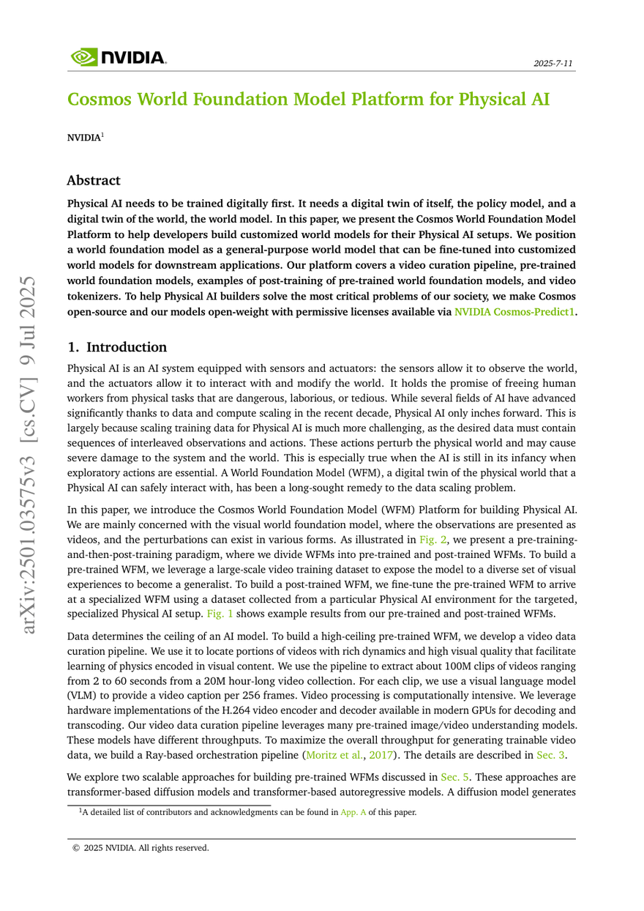

想看真实使用过程？[24 秒 Web 界面演示 →](#web-界面)

## 目录

1. [为什么做这个](#为什么做这个)
2. [翻译效果对比](#翻译效果对比)
3. [实现机制：从原页到可信译文](#实现机制从原页到可信译文)
4. [Web 界面](#web-界面)
5. [特性](#特性)
6. [快速开始 · Web 模式](#快速开始--web-模式)
7. [快速开始 · Agent Skill 模式](#快速开始--agent-skill-模式)
8. [使用自己的 API Key 与供应商](#使用自己的-api-key-与供应商)
9. [命令行](#命令行)
10. [质量保障](#质量保障)
11. [基准集](#基准集)
12. [FAQ](#faq)
13. [Roadmap](#roadmap)
14. [License 与引用](#license-与引用)

## 为什么做这个

读英文论文的人每天都在重复同一套动作：左边开原文，右边开翻译工具，来回对照。而现有工具在学术 PDF 上各有各的短板：

- **粘贴进对话式 AI**：得到的只是纯文本，版式、公式、图表、交叉引用全丢；
- **浏览器翻译插件**：为网页设计，PDF 的双栏与行内公式常被打散串行；
- **在线文档翻译**：版式近似还原，但公式没有专门保护，易被当作普通文本改写。

学术 PDF 恰恰是版式最密集的文体——编号公式、算法伪代码、双栏排版、图注表格、参考文献，翻坏任何一处都直接影响可读性与可信度。

SuperTranslate 的三条设计原则：

1. **不重排版面**。自研 native 引擎在原 PDF 上原位替换文本，页面尺寸、图像、矢量图形、文本块位置全部保持；公式、表格、算法伪代码、引用标记 `[1][2]` 划入保护区，原样保留。
2. **翻完必须自证**。每次翻译后自动运行 QA：漏翻检测、保护区改动检测（连实验数字被篡改都能查出）、文本重叠、图片丢失、视觉回归、术语一致性，结果写入 `*.qa.json`。
3. **不达标不算完成**。确定性质量循环对缺陷做有界修复，候选结果只有错误分数严格改善才替换旧输出，否则回滚快照。

## 翻译效果对比

两列并排：**左原文，右 SuperTranslate 译文**，点击图片查看原始分辨率。所有对比图均渲染自真实翻译产物（`pdftoppm`，整页 120 DPI、局部放大 240 DPI）；保版式翻译不改变页面几何，同一位置左右直接可比。素材清单与证据指针见 [docs/assets/comparison/manifest.json](docs/assets/comparison/manifest.json)。

### Direct Preference Optimization（27 页 · CC BY 4.0）· 含 pdf2zh 横向实测

DPO 第 4 页同时含**小节标题、加粗导语与公式 (4)–(7)**，最能暴露版式问题。同一份原文，三种输出——中列为 [pdf2zh](https://github.com/Byaidu/PDFMathTranslate)（v1.9.11，默认 Google 翻译后端，同机实测），右列为 SuperTranslate（DeepSeek 后端）：

<table>
  <tr>
    <th width="33%">原文</th>
    <th width="33%">pdf2zh</th>
    <th width="33%">SuperTranslate</th>
  </tr>
  <tr>
    <td><a href="docs/assets/comparison/dpo/trio_p4_original.png">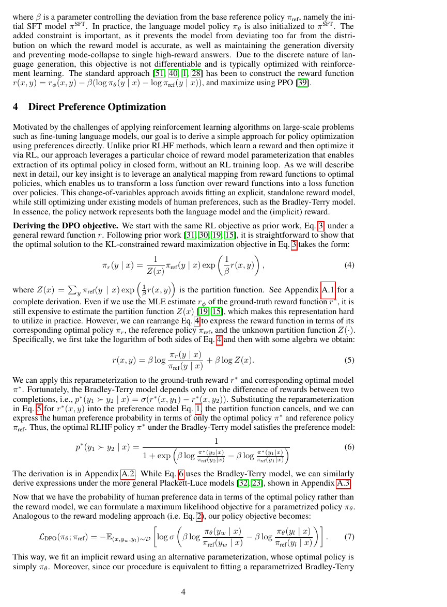</a></td>
    <td><a href="docs/assets/comparison/dpo/trio_p4_pdf2zh.png">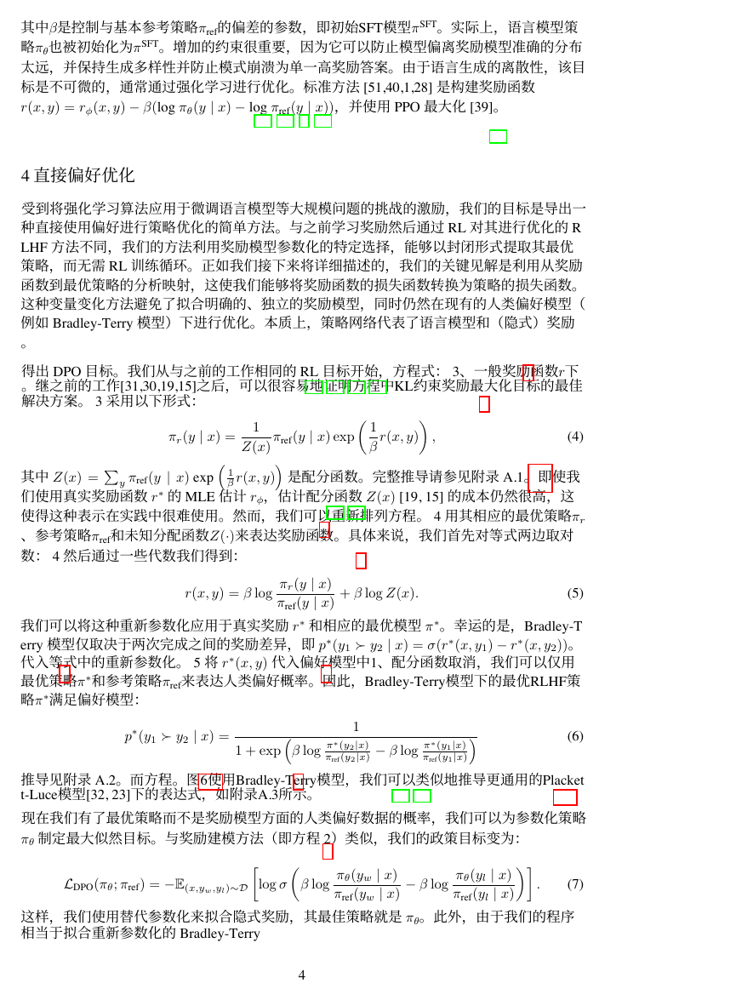</a></td>
    <td><a href="docs/assets/comparison/dpo/trio_p4_ours.png">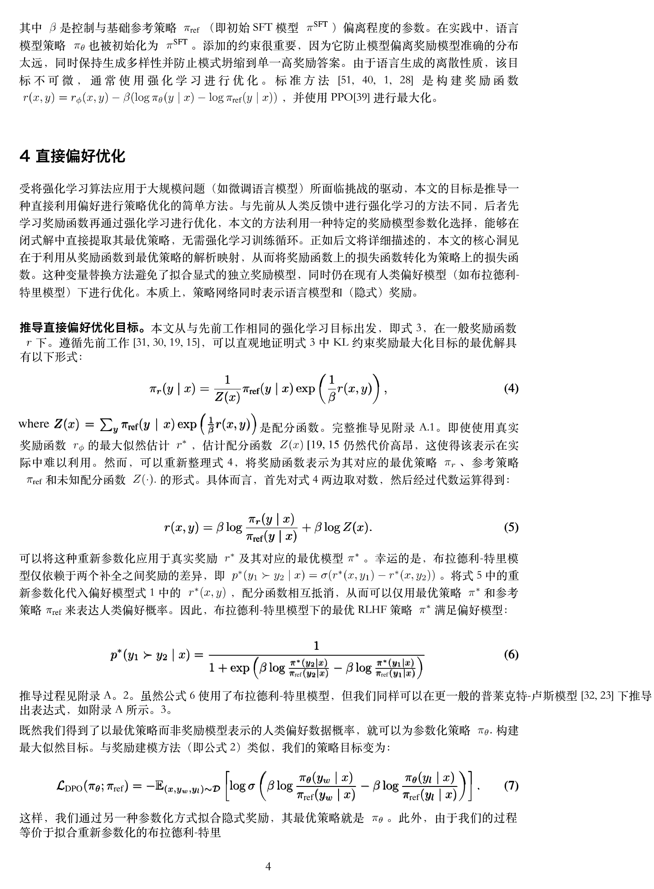</a></td>
  </tr>
</table>

**细节 ① 摘要标题**——pdf2zh 把「Abstract」逐词直译成**「抽象的」**且丢失标题粗体；SuperTranslate 术语库给出学术惯用的**「摘要」**并保留标题字重（上原文 / 中 pdf2zh / 下 SuperTranslate）：

<a href="docs/assets/comparison/dpo/crop_abstract_original.png">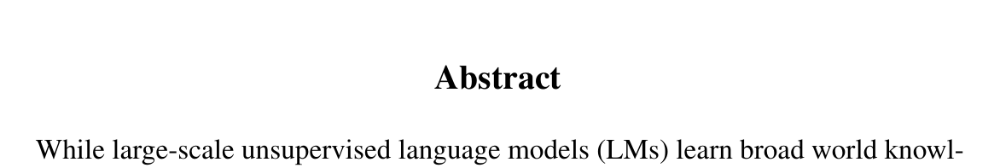</a>
<a href="docs/assets/comparison/dpo/crop_abstract_pdf2zh.png">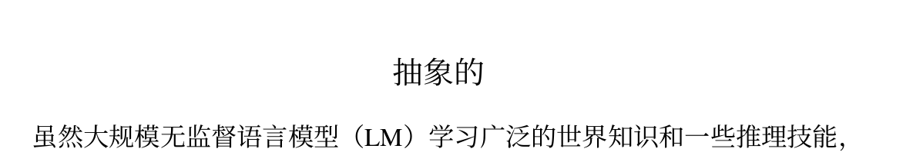</a>
<a href="docs/assets/comparison/dpo/crop_abstract_ours.png">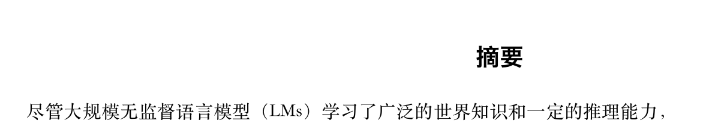</a>

**细节 ② 加粗导语与交叉引用**——pdf2zh 丢失导语粗体，Eq. 3 与文献引用的链接框脱离文字、漂浮成空框；SuperTranslate 的**「推导直接偏好优化目标。」粗体保真**，`[31,30,19,15]` 与式 3 原位嵌入重新断行的中文句：

<a href="docs/assets/comparison/dpo/crop_boldlead_original.png">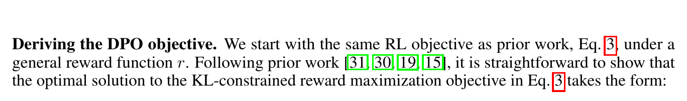</a>
<a href="docs/assets/comparison/dpo/crop_boldlead_pdf2zh.png">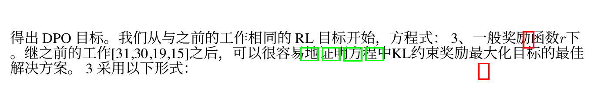</a>
<a href="docs/assets/comparison/dpo/crop_boldlead_ours.png">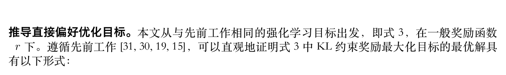</a>

**本轮实测口径**：SuperTranslate 为单遍翻译 + inspect 审计——27 页全篇共 3 处报告（1 条版面警告 + 2 处错误，均集中在附录 GPT-4 样例框），**展示页 p1 / p4 零缺陷**；pdf2zh 同机约 1.5 分钟完成。两侧完整命令、版本与环境见 [docs/assets/comparison/NOTES.md](docs/assets/comparison/NOTES.md)。本对比聚焦**版式与结构保真**；pdf2zh 默认后端为逐句机器翻译，译文文采差异应主要归因于各自后端。

### Qwen-RobotWorld Technical Report（25 页 · CC BY 4.0）

<table>
  <tr>
    <th width="50%">原文</th>
    <th width="50%">SuperTranslate</th>
  </tr>
  <tr>
    <td><a href="docs/assets/comparison/qwen_robotworld/original_p4_trim.png">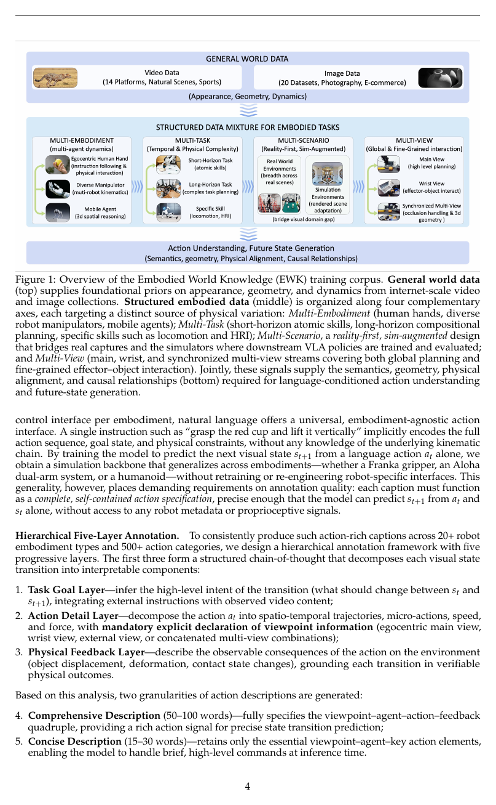</a></td>
    <td><a href="docs/assets/comparison/qwen_robotworld/ours_p4_trim.png">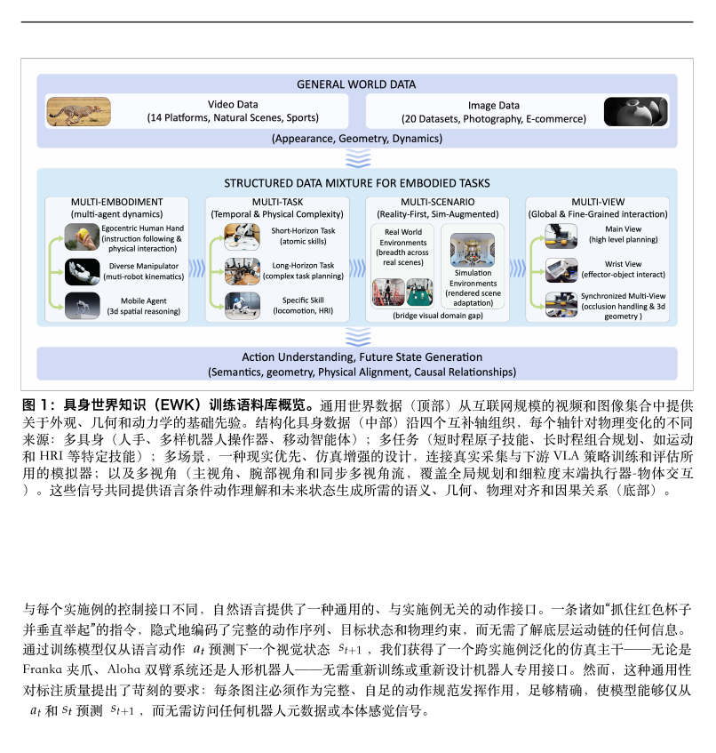</a></td>
  </tr>
</table>

**看什么**：第 4 页上半区特写——大型数据混合结构图原样、粗体图注照译，正文段中行内数学符号 `s_t`、`a_t`、`s_{t+1}` 原样保留，验证复杂图文混排。（本页下半区编号列表的粗体导语存在已知待优化项，见 [docs/assets/comparison/NOTES.md](docs/assets/comparison/NOTES.md)。）

### Cosmos World Foundation Model（75 页 · CC BY 4.0）

<table>
  <tr>
    <th width="50%">原文</th>
    <th width="50%">SuperTranslate</th>
  </tr>
  <tr>
    <td><a href="docs/assets/comparison/cosmos/original_p1.png">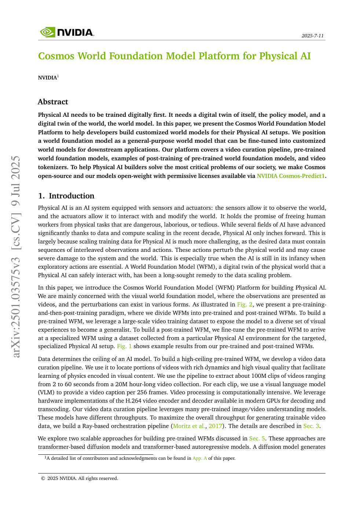</a></td>
    <td><a href="docs/assets/comparison/cosmos/ours_p1.png">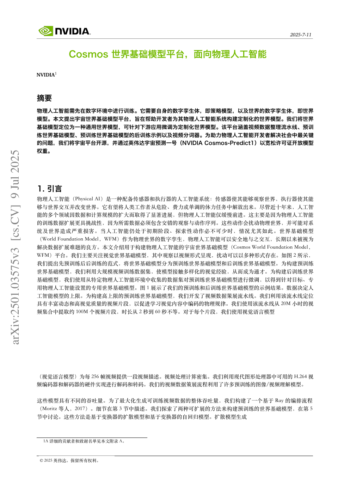</a></td>
  </tr>
  <tr>
    <td><a href="docs/assets/comparison/cosmos/original_p34.png">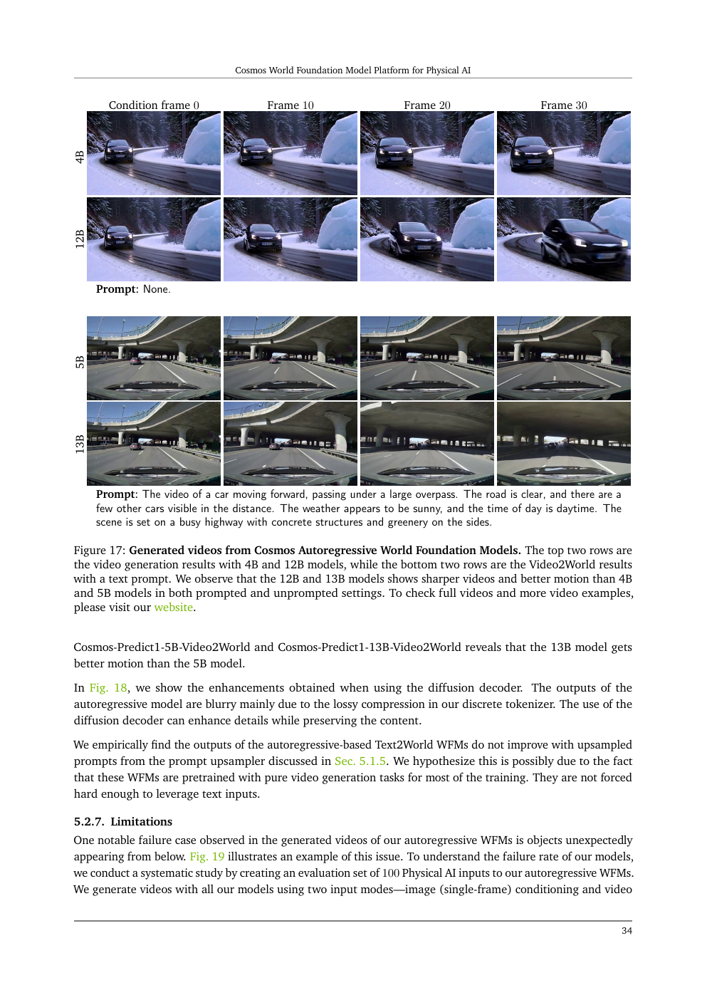</a></td>
    <td><a href="docs/assets/comparison/cosmos/ours_p34.png">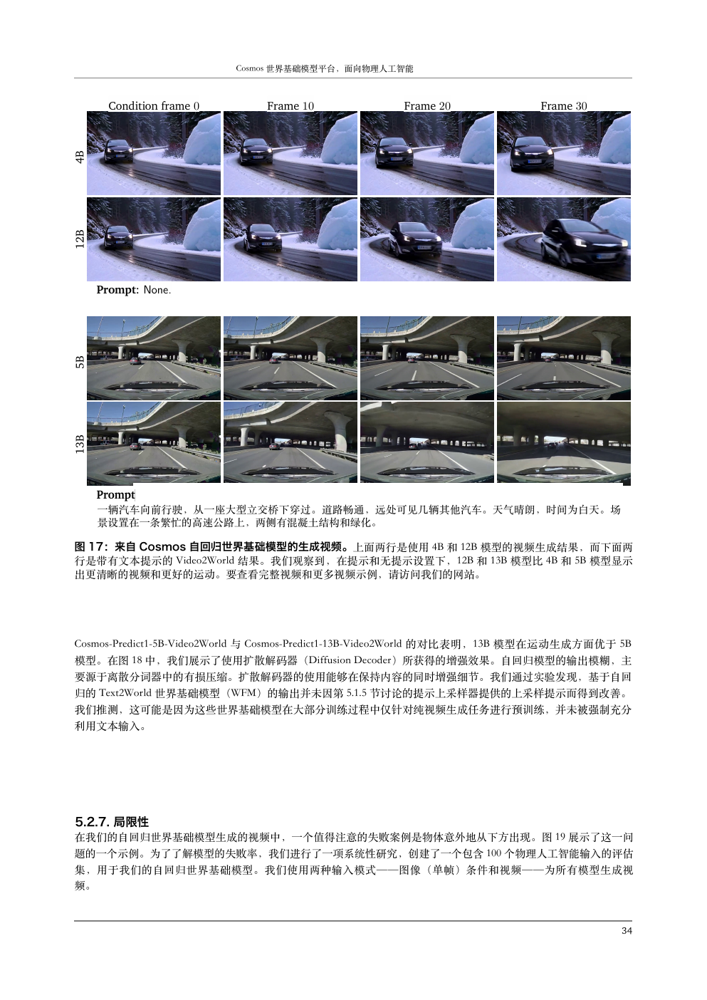</a></td>
  </tr>
</table>

<table>
  <tr>
    <td align="center" width="50%"><a href="docs/assets/comparison/cosmos/crop_figure_original.png">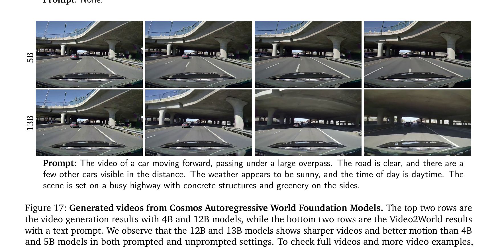</a><br/><sub>局部放大 · 原文：第 34 页图 17 下半组（240 DPI）</sub></td>
    <td align="center" width="50%"><a href="docs/assets/comparison/cosmos/crop_figure_ours.png">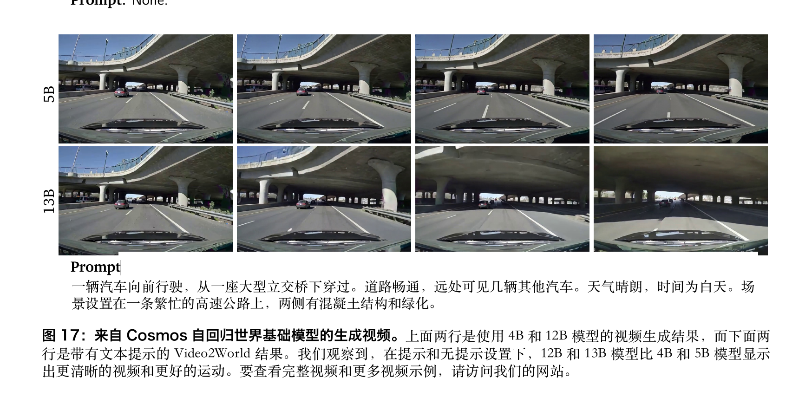</a><br/><sub>局部放大 · 译文：帧网格原样，Prompt 说明与加粗图注译为中文</sub></td>
  </tr>
</table>

**看什么**：第 34 页已在这份 75 页 NVIDIA 技术报告深处——图 17 视频帧网格（4B/12B/5B/13B 四行）原样保留，Prompt 说明段落与加粗图注译为中文，长文档后段质量不衰减。这篇论文的发布验收通过逐对象审计：**75/75 页、793 个翻译对象、0 缺陷**（详见[质量保障](#质量保障)）。

### 经典论文：局部放大对比（Attention / DDPM / ResNet）

Attention、DDPM 与 ResNet 采用 arXiv 非独占许可（非 CC），按下方[展示政策](#展示政策)只展示小幅局部对比与聚合指标，不公开整页译文。

**独立公式**——上为原文、下为译文：段落译成了中文，公式 (1) 与编号一个像素没动。

<a href="docs/assets/comparison/attention/banner_formula_original.png">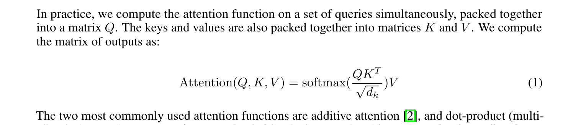</a>
<a href="docs/assets/comparison/attention/banner_formula_ours.png">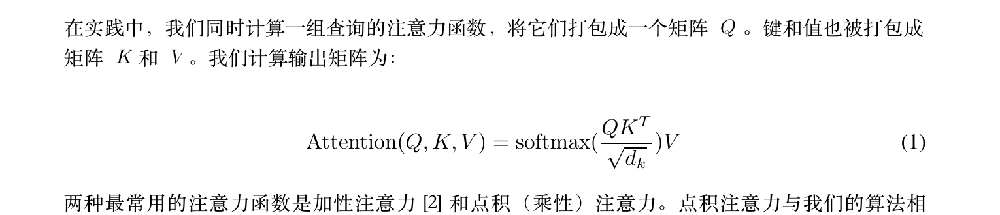</a>

**行内公式（难度更高）**——`p_θ(x_0)`、`x_0 ∼ q(x_0)` 这类数学要嵌进重新断行的中文句子里，还要与引用标记 `[53]` 一起原样保留：

<a href="docs/assets/comparison/ddpm/crop_inline_original.png">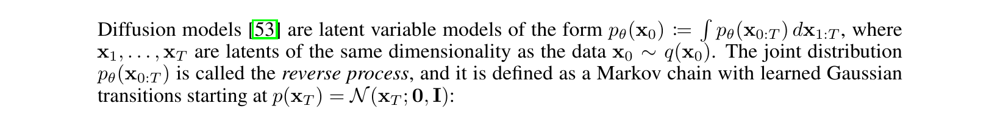</a>
<a href="docs/assets/comparison/ddpm/crop_inline_ours.png">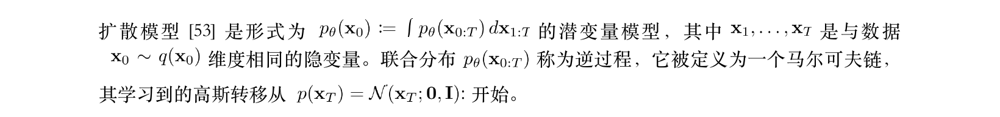</a>

<table>
  <tr>
    <td align="center"><a href="docs/assets/comparison/attention/crop_figure_original.png">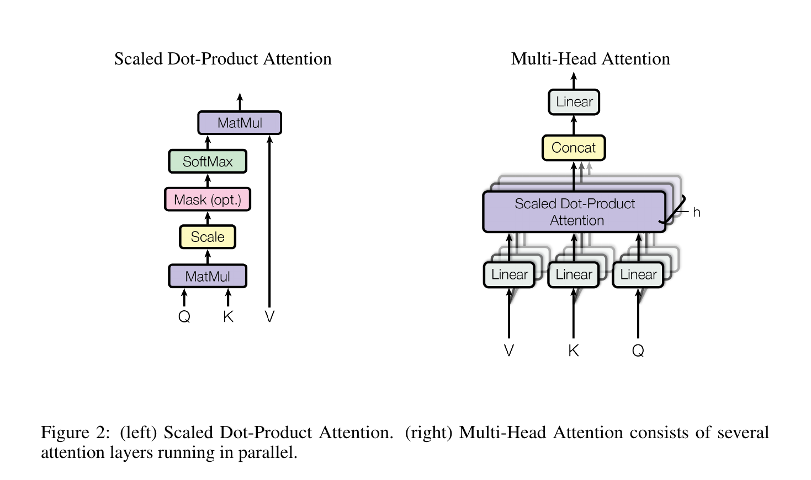</a><br/><sub>Attention · 图 2 注意力结构图 · 原文</sub></td>
    <td align="center"><a href="docs/assets/comparison/attention/crop_figure_ours.png">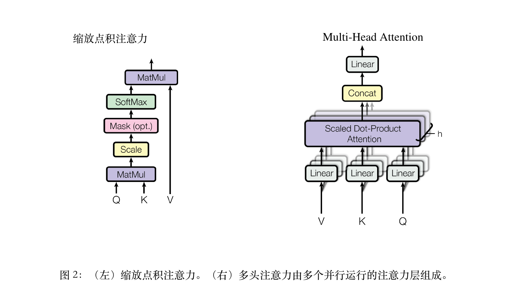</a><br/><sub>Attention · 图 2 注意力结构图 · 译文（图内文字保留，图注翻译）</sub></td>
  </tr>
  <tr>
    <td align="center"><a href="docs/assets/comparison/resnet/crop_twocol_original.png">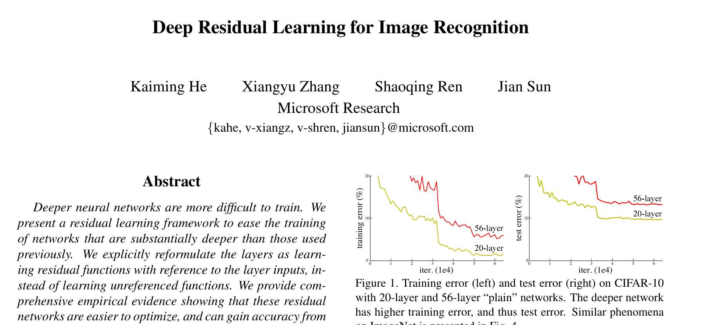</a><br/><sub>ResNet · 双栏首屏 · 原文</sub></td>
    <td align="center"><a href="docs/assets/comparison/resnet/crop_twocol_ours.png">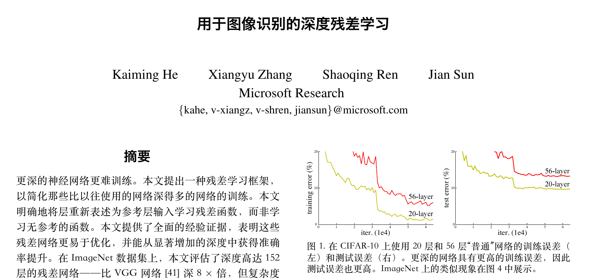</a><br/><sub>ResNet · 双栏首屏 · 译文（标题/摘要/图 1 排版原位）</sub></td>
  </tr>
</table>

批次指标（classic20 r2 批次，20/20 完成；翻译模型 `deepseek-v4-pro`，quality 档，迭代 QA）：

| 论文 | 页数 | 视觉评分 | 错误级缺陷 | 严格门禁 | 翻译耗时 |
|---|---|---|---|---|---|
| Attention Is All You Need | 15 | 0.9041 | 0 | 通过 | 135.1s |
| Deep Residual Learning (ResNet) | 12 | 0.8621 | 0 | 通过 | 240.2s |

两篇均无错误级缺陷，仅有不阻断门禁的版面风险提示（`high_risk_layout`）；视觉评分为渲染墨迹相似度，严格门禁要求 ≥ 0.55。

### 展示政策

对比素材遵循 [benchmarks/classic20/README.md](benchmarks/classic20/README.md) 的许可政策：**仅 Creative Commons 许可的论文公开展示完整翻译页**（本节的 DPO、Qwen-RobotWorld 与 Cosmos 均为 CC BY 4.0）；arXiv 非独占许可的论文只展示小幅局部 crop 与聚合指标。基准 `showcase_cc` 组的六篇 CC 许可经典论文中，DPO 已完成并展示于上文；其余五篇（LLaMA / Mistral / Mamba / CoT / vLLM）翻译产物就绪后继续补充。

### 相比其他读论文的方式，优势在哪里

各方式定位并不相同：硬读原文最忠实但最慢；聊天粘贴最轻但丢版式；重排式工具翻得快但版面失真。SuperTranslate 补的是它们之间缺失的一层——**译文与原文逐像素可对照、质量可自证**。此表为定位对照而非优劣评判，别家能力描述基于公开文档（2026-08 查阅）。

| 能力 | 硬读英文原文 | GPT / Kimi 粘贴 | Google 文档翻译 | 沉浸式翻译 | pdf2zh (PDFMathTranslate) | SuperTranslate（本项目） |
|---|---|---|---|---|---|---|
| **中文母语阅读速度** | — 全程英文 | ✓ 纯文本中文 | ✓ 译文可读 | ✓ 双语网页 | ✓ 译文 PDF | ✓ 纯中文 / 双语 PDF |
| **版式保持** | ✓ 原文即版式 | — 版式全失 | ◐ 近似还原¹ | ◐ 对照式输出为主¹ | ◐ 以保留为目标，重排实现¹ | ✓ 原位替换，页面几何逐像素一致 |
| **独立公式完整** | ✓ | — 易丢失乱码 | — 无专门保护¹ | ◐ 未见专门机制¹ | ◐ 声明保留¹ | ✓ 冻结保护区，不经过模型 |
| **行内公式嵌中文句** | 不适用 | — | — | ◐¹ | ◐¹ | ✓ 重新断行仍原样保留（见上文 DDPM 例） |
| **图表与图注** | ✓ | — 无法处理 | ◐ 图片不翻译¹ | ◐ 视文档类型¹ | ◐ 声明保留¹ | ✓ 图内文字保护 + 图注翻译 |
| **长文档（75 页级）** | ✓ 但耗时最长 | — 上下文受限 | ◐ 有大小限制¹ | ◐ 未见说明¹ | ◐ 未见承诺¹ | ✓ Cosmos 75/75 页实测 0 缺陷 |
| **术语一致性** | 取决于读者 | — 逐段漂移 | — | — | — | ✓ 1,066 条语料逐块注入 + 可扩展 |
| **双栏对照阅读器** | — | — | — | ◐ 网页交错对照 | ◐ 输出双语 PDF¹ | ✓ 内置同步滚动阅读器 |
| **译后 QA 审计** | 不适用 | — | — | — | — 未见¹ | ✓ 对象级审计 + `*.qa.json` + 严格变好循环 |
| **Agent 一句话集成** | — | ◐ 聊天可用无版式 | — | — | — | ✓ Claude Code / Cursor Skill |
| **批量处理** | — | — 手动粘贴 | — 逐份上传 | ◐ 逐份为主¹ | ✓ 提供 CLI¹ | ✓ Web 并行 + 治理型批处理 |
| **本地部署 · 数据不出机** | ✓ | — 云服务 | — 云服务 | ◐ 扩展+云 API¹ | ✓ 本地运行¹ | ✓ Docker / uv 自托管 |
| **开源可审计** | 不适用 | — 闭源 | — 闭源 | ◐ 扩展本体闭源¹ | ✓ AGPL-3.0¹ | ✓ AGPL-3.0，QA 证据随代码公开 |

✓ 具备 · ◐ 部分具备/视情况 · — 不提供

> ¹ 对其他工具的描述基于各自公开文档与产品页（2026-08 查阅），能力可能随版本变化，如有出入欢迎提 issue 指正。
>
> pdf2zh 的同机图像基线已补齐：见上文 [DPO 横向实测](#direct-preference-optimization27-页--cc-by-40--含-pdf2zh-横向实测)（v1.9.11，默认 Google 后端，完整命令与环境见 [docs/assets/comparison/NOTES.md](docs/assets/comparison/NOTES.md)）。

## 实现机制：从原页到可信译文

结构先冻结、正文再翻译，最后由独立 QA 与 strict gate 验收。三张图分别回答三个问题：整体流程怎么走、质量怎么收敛、裁决权在谁手里。

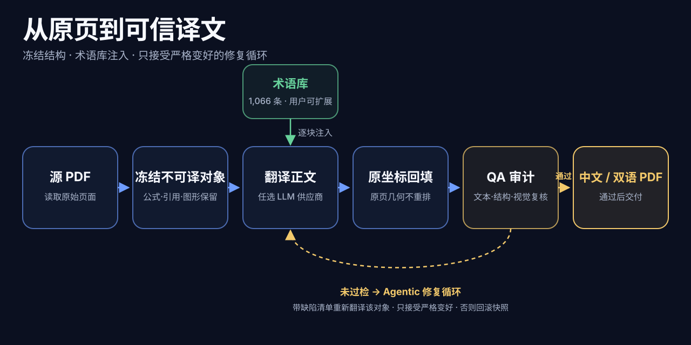

SuperTranslate 先冻结原 PDF 中不可改的结构对象，只翻译可替换正文，再按原坐标回填并通过 QA 审计，输出纯中文与双语两种 PDF。

- 文本块携带页码、`bbox`、字号和语义角色；公式、引用与 URL 会先变成可逆占位符，保护区不交给模型改写。（`pdf_zh_translator/pdf_layout.py:370-426`；`pdf_zh_translator/pdf_layout.py:19545-19601`）
- 术语按当前文本块注入提示词；标题、正文、图注使用结构提示，多供应商层共享同一约束。（`pdf_zh_translator/translators.py:543-647`；`pdf_zh_translator/translators.py:832-923`）
- 请求同时受批次数和字符数约束；JSONL 缓存、占位符校验与单块回退让同一输入可以确定性重放。（`pdf_zh_translator/translators.py:92-167`；`pdf_zh_translator/translators.py:390-450`）
- 渲染只擦除可替换文字，再用 CJK 字体链在原 `bbox` 内排版；页面尺寸、图像、矢量、链接与源公式继续沿用原页。（`pdf_zh_translator/pdf_layout.py:1338-1393`；`pdf_zh_translator/pdf_layout.py:8012-8042`；`pdf_zh_translator/pdf_layout.py:25343-25370`）
- QA 在隔离子进程中复核候选，纯中文与双语 PDF 由同一翻译结果生成并一起进入快照保护。（`app/api/papers.py:1763-1836`；`app/api/papers.py:2767-2802`）

### 只接受严格变好的翻译

每次修复都重跑同一组检测器；持平或变差，立即回滚。

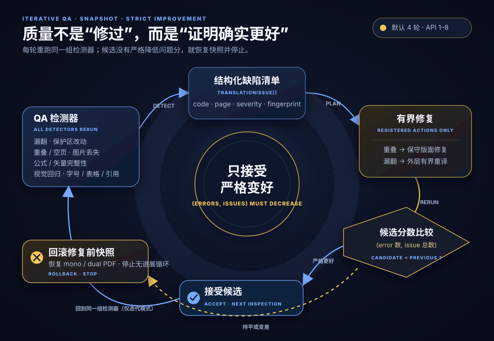

每轮 QA 都重跑同一组检测器；候选只有严格减少错误与问题总数才被接受，否则立即恢复修复前快照。

- 检测覆盖漏翻、保护区变更、重叠与空页、图片/矢量/公式缺失、视觉墨迹、字号、表格与引用；术语审计当前只给提示，不进入问题分。（`pdf_zh_translator/pdf_layout.py:2706-2718`；`pdf_zh_translator/page_inspector.py:2295-2558`；`app/api/papers.py:2890-2922`）
- QA 输出稳定的 `TranslationIssue[]`；规划器只允许 `accept`、`repair_layout`、`retranslate`、`stop` 四类登记动作。（`app/services/quality_agent.py:11-87`；`docs/adr/0001-independent-translation-quality-loop.md:68-75`）
- 迭代模式默认最多 4 轮，API 明确限制为 1–8；每轮都从隔离检测开始。（`app/api/papers.py:1201-1241`；`app/api/papers.py:2306-2382`）
- 修复前同时快照 mono 与 dual PDF；修复后重跑检测器，并按 `(error 数, issue 总数)` 做字典序比较。（`app/api/papers.py:2445-2475`；`app/api/papers.py:2746-2788`）
- 候选持平或变差会被原子回滚并停止无进展循环；外层恢复循环另存跨尝试的全局最佳。（`app/api/papers.py:2476-2494`；`app/api/papers.py:2059-2206`；`app/api/papers.py:2791-2802`）

### 修复者不能给自己打分

可写的修复方与只读审查方分权，是否交付由证据裁决。

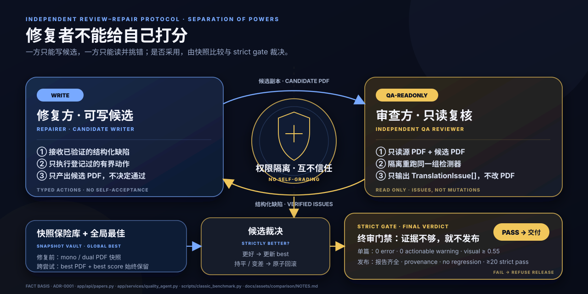

修复方只写候选、审查方只读挑错，双方都不能自行放行；快照比较保留全局最佳，最终由 strict gate 决定是否交付。

- ADR 明确要求视觉或模型审查只能提出问题、不能直接修改 PDF；规范输出是独立的 `TranslationIssue[]`，成为阻断项前还要经过确定性验证。（`docs/adr/0001-independent-translation-quality-loop.md:20-27`；`docs/adr/0001-independent-translation-quality-loop.md:56-62`）
- 当前 QA 通过隔离子进程读取 `original_path` 与 `translated_path`，仅把检测结果反序列化为问题清单；公开验收产物也使用 `qa-readonly` 角色记录。（`app/api/papers.py:1763-1836`；`docs/assets/comparison/NOTES.md:56-61`）
- 修复方只能执行代码登记的动作；布局修复写候选 mono PDF，并在需要时重建 dual PDF，不能自行判定通过。（`app/services/quality_agent.py:11-87`；`app/api/papers.py:2421-2470`；`app/api/papers.py:2767-2780`）
- 修复前快照负责单轮原子回滚；外层恢复循环持续保存 `best_result`、`best_snapshots` 与 `best_score`，预算耗尽也恢复全局最佳。（`app/api/papers.py:2445-2494`；`app/api/papers.py:2059-2206`；`app/api/papers.py:2783-2802`）
- 单篇 strict pass 要求 0 error、0 actionable warning、视觉分不低于 0.55；发布 gate 还检查报告齐全、来源、布局轴与回归，并默认要求至少 20 篇 strict pass。（`scripts/classic_benchmark.py:185-200`；`scripts/classic_benchmark.py:1363-1529`；`scripts/classic_benchmark.py:1566-1567`）

### 专业术语库

上文翻译层提到的「术语按块注入提示词」，背后是一个专门为学术翻译设计的语料库。通用翻译最伤专业性的就是术语：同一个概念在一篇论文里被译出好几种说法，或者按字面直译成中文文献里不存在的叫法。SuperTranslate 用内置语料库把译名钉住。

**规模与构成**：共 **1,066 条术语、23 个分类**，分三份语料文件维护——

- [`pdf_zh_translator/corpus.json`](pdf_zh_translator/corpus.json)：348 条，CS / ML / 数学 / 通用 4 个基础分类
- [`pdf_zh_translator/corpora/ai_conferences.json`](pdf_zh_translator/corpora/ai_conferences.json)：251 条，5 个分类（NeurIPS·ICML·ICLR / CVPR 视觉 / ACL NLP / Agent·对齐·安全 / 论文版式与写作）
- [`pdf_zh_translator/corpora/top_venue_tracks.json`](pdf_zh_translator/corpora/top_venue_tracks.json)：467 条，按顶会分 track 细分 14 类（NeurIPS 基础理论、ICML 优化与学习理论、CVPR 3D 几何重建等）

**语料如何参与翻译**：不是把 1,066 条全部塞进提示词——翻译每个文本块时，引擎从语料库检索与该块内容相关的术语拼入 prompt（`pdf_zh_translator/translators.py:832-905`；`pdf_zh_translator/corpus.py`）；再配合首现规则：专有名词首次出现译为「中文术语（English Term）」，之后全篇只用中文。

**质量怎么守**：语料库本身由 `corpus-lint --strict` 做跨领域冲突检查，是 CI 门禁之一；译后 QA 会审计译文是否采用规范译法（提示级，不进错误分）。

样例（真实条目）：

| English | 规范译法 |
|---|---|
| PAC-Bayes Bound | PAC-贝叶斯界 |
| Rademacher Complexity | 拉德马赫复杂度 |
| Uniform Convergence | 一致收敛 |
| Score-Based Generative Model | 基于分数的生成模型 |
| Partially Observable Markov Decision Process | 部分可观测马尔可夫决策过程 |
| Amortized Inference | 摊销推断 |

**自己扩展术语库**——术语库不是只读的，三种方式按需选：

```bash
# 方式一：一条命令加词（FIELD 是分类名，如 ml、acl_nlp，也可以起自己的）
python -m pdf_zh_translator corpus-add ml "world model=世界模型" --source my-lab

# 方式二：整包挂载——把自己的词表 JSON 放进 corpora/ 目录即自动加载，
# 与官方条目同名时以你的为准（适合团队/领域私有词表）
cat > pdf_zh_translator/corpora/my_domain.json << 'EOF'
{"robotics_lab": {"visuomotor policy": "视觉运动策略", "teleoperation": "遥操作"}}
EOF

# 方式三：候选审阅流水线——翻译过程会收集未入库的术语候选，
# 去重（corpus-review）→ 自动分类（corpus-audit）→ 批量入库（corpus-promote）
python -m pdf_zh_translator corpus-lint --strict   # 任何方式改完都用它把关
```

改完跑 `corpus-lint --strict` 校验冲突即可生效，无需改代码。也欢迎把通用性强的条目 PR 回上游，批量变更流程见 [CONTRIBUTING.md](CONTRIBUTING.md)。

### 模块视图（Web 应用全链路）

上面是翻译引擎的机制视图；放到 Web 应用里，一次翻译任务的完整链路如下：

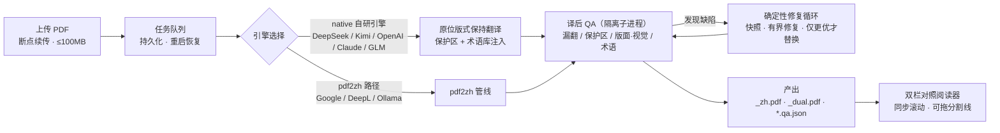
```mermaid
flowchart LR
    A["上传 PDF<br/>断点续传 · ≤100MB"] --> B["任务队列<br/>持久化 · 重启恢复"]
    B --> C{"引擎选择"}
    C -->|"native 自研引擎<br/>DeepSeek / Kimi / OpenAI / Claude / GLM"| D["原位版式保持翻译<br/>保护区 + 术语库注入"]
    C -->|"pdf2zh 路径<br/>Google / DeepL / Ollama"| E["pdf2zh 管线"]
    D --> F["译后 QA（隔离子进程）<br/>漏翻 / 保护区 / 版面·视觉 / 术语"]
    E --> F
    F -->|"发现缺陷"| G["确定性修复循环<br/>快照 · 有界修复 · 仅更优才替换"]
    G --> F
    F --> H["产出<br/>_zh.pdf · _dual.pdf · *.qa.json"]
    H --> I["双栏对照阅读器<br/>同步滚动 · 可拖分割线"]
```

两条翻译路径：

- **native 自研引擎**（默认，`PAPER_CHINA_TRANSLATION_ENGINE=native`）：版式保持、保护区、术语注入、QA 修复循环的完整能力，覆盖 DeepSeek / Kimi / OpenAI / Anthropic / GLM。Kimi / Anthropic / GLM 强制走 native 引擎。
- **pdf2zh 路径**：复用捆绑的 [pdf2zh (PDFMathTranslate)](https://github.com/Byaidu/PDFMathTranslate) 管线，支持 Google（免 API key 的 `fast` 档）、DeepL、Ollama 本地模型。

设计决策记录见 [docs/ARCHITECTURE.md](docs/ARCHITECTURE.md) 与 [docs/adr/](docs/adr/)。完整单图版技术细节见 [docs/assets/mechanism.svg](docs/assets/mechanism.svg)。

## Web 界面

以下全部为真实运行截图（Playwright 无头浏览器对本仓库 main 分支实录，复现步骤见 [docs/assets/webui/NOTES.md](docs/assets/webui/NOTES.md)）。

<table>
  <tr>
    <td width="50%"><a href="docs/assets/webui/library.png">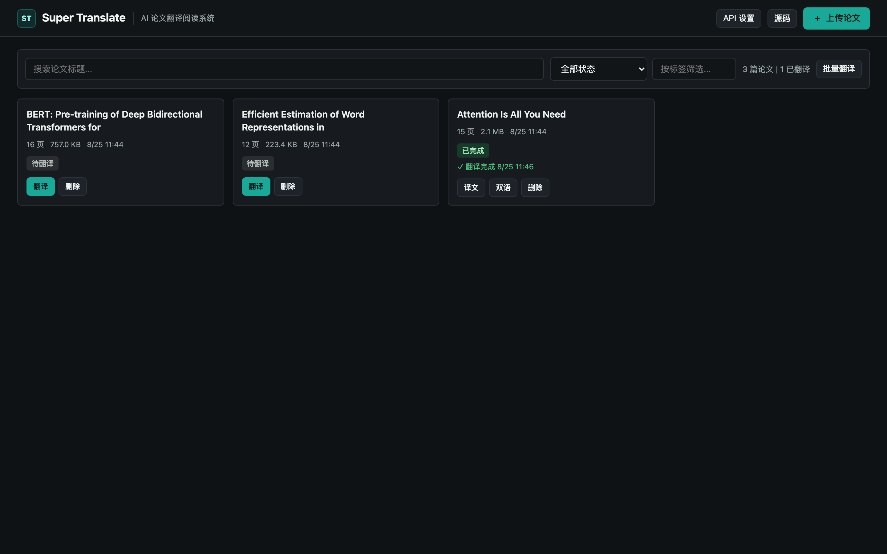</a><br/><sub>论文库：翻译完成的论文卡片直接提供「译文 / 双语」阅读入口</sub></td>
    <td width="50%"><a href="docs/assets/webui/upload.png">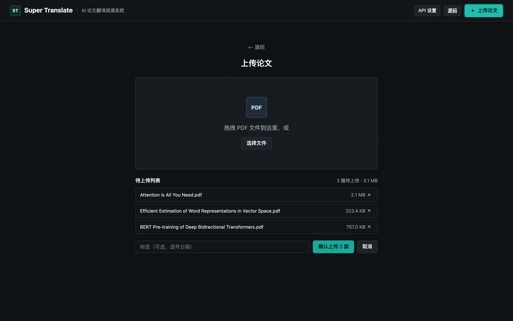</a><br/><sub>上传：拖拽即传、可多选排队，大文件自动分块断点续传</sub></td>
  </tr>
  <tr>
    <td><a href="docs/assets/webui/reader.png">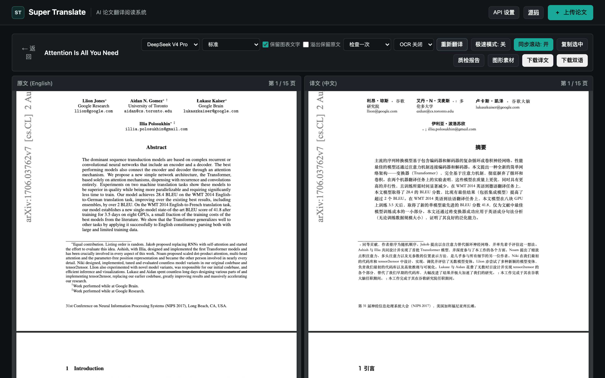</a><br/><sub>双栏对照阅读器：左原文右译文，同步滚动，分割线可拖动</sub></td>
    <td><a href="docs/assets/webui/providers.png">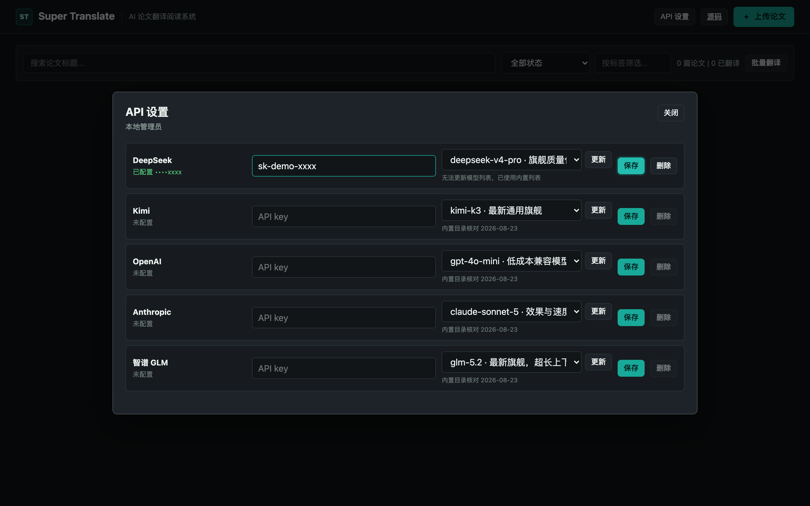</a><br/><sub>API 设置：五家供应商各自存 key，已存 key 只显示末 4 位</sub></td>
  </tr>
</table>

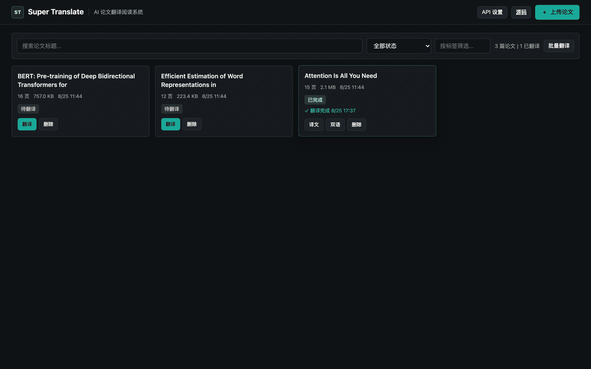

<sub>13 秒精简动图：论文库 → 打开 Attention → 双栏同步滚动（引言、公式页）→ 返回论文库；24 秒高清 MP4 版见<a href="https://asimfish.github.io/super_translate/#ui">项目主页</a>。</sub>

## 特性

**翻译引擎**

- **原位版式保持**：native 引擎保持原页面尺寸、图像、矢量图形与文本块位置，不重排、不重构页面
- **保护区机制**：公式、表格、算法伪代码、参考文献、引用标记 `[1][2]` 原样保留；图内文字默认保护（可选翻译图内可编辑文本）
- **纯中文输出**：术语首次出现给出「中文术语（English Term）」，之后统一用中文；粗体/斜体/标题层级保留
- **专业术语库**：内置 **1,066 条、23 个分类**的学术术语库（顶会分 track 术语 + CS/ML/数学基础词表），翻译时按块注入相关术语，译后审计规范译法，`corpus-lint` 作 CI 门禁——详见[专业术语库](#专业术语库)
- **双输出**：`_zh.pdf`（纯中文）+ `_dual.pdf`（原文/译文对照）
- **OCR 后备**：扫描版（纯图片）PDF 可先 OCR 再翻译（基于 Tesseract）

**质量与可靠性**

- **译后 QA**：漏翻、保护区改动（含实验数字被篡改）、文本重叠、图片/矢量图/公式丢失、空白页、视觉回归、术语一致性；报告写入机器可读的 `*.qa.json`
- **确定性修复循环**：单轮或迭代模式，快照 + 有界修复 + 全检测器重跑，仅当错误分数严格改善才替换输出
- **任务持久化**：任务历史、心跳、取消、进度实时推送；进程重启后排队任务自动重新调度，修不好的任务保留最佳产物并标记 `repair_pending`
- **断点续传上传**：8 MiB 以上 PDF 自动分块（4 MiB/块，SHA256 校验），代理中断可续传，按内容哈希去重（单文件上限 100 MB）

**部署与协作**

- **多 LLM 后端**：DeepSeek / Kimi K3 / OpenAI（及兼容端点）/ Anthropic Claude / GLM / Google / DeepL / Ollama，详见[使用自己的 API Key 与供应商](#使用自己的-api-key-与供应商)
- **按用户加密的 API Key**：每个账号的密钥 AES-GCM 加密存储，不回传浏览器、不写入任务文件
- **多用户与隔离**：用户名密码账号（PBKDF2）、workspace token 轻量隔离、API bearer token、内置限流
- **双栏对照阅读器**：原文/译文同步滚动，分割线可拖动，暗色主题，移动端自适应
- **基准展示页**：`/showcase` 只读展示基准指标与 CC 许可论文的翻译预览
- **飞书通知**：翻译完成 webhook 推送

## 快速开始 · Web 模式

### 方式一：Docker Compose（部署为网站）

```bash
git clone https://github.com/asimfish/super_translate.git
cd super_translate

cp .env.example .env
# 编辑 .env：
#   PAPER_CHINA_CREDENTIAL_ENCRYPTION_KEY —— 必填，生成：openssl rand -base64 32 | tr '+/' '-_'
#   PAPER_CHINA_API_TOKEN               —— 公网部署必填的访问令牌
# 编辑 Caddyfile，把 your-domain.example.com 换成你的域名

docker compose up -d --build
```

打开 `https://你的域名`，首次访问输入 API token，登录后在「API 设置」里填入所选后端的 key 即可翻译。健康检查：`curl https://你的域名/health`。

只在内网用、没有域名？跳过 Caddy 只起应用：`docker compose up -d app`（监听 `127.0.0.1:8000`，配合 SSH 隧道访问）。完整教程（VPS + HTTPS + 备份 + 故障排查）见 [docs/DEPLOYMENT.md](docs/DEPLOYMENT.md)。

### 方式二：uv（本机运行）

```bash
git clone https://github.com/asimfish/super_translate.git
cd super_translate

uv sync
export PAPER_CHINA_DEEPSEEK_API_KEY="你的 DeepSeek API Key"
uv run uvicorn app.main:app --host 127.0.0.1 --port 8001
```

浏览器打开 <http://localhost:8001>。本机回环访问无需配置 token。没有 uv 的话，`python3 -m venv .venv && source .venv/bin/activate && pip install -e .` 效果等同；参与开发（含测试依赖）用 `uv sync --extra dev`，见 [CONTRIBUTING.md](CONTRIBUTING.md)。

日常使用（上传、选后端、看进度、双栏阅读、下载）见中文教程 [docs/TUTORIAL.zh-CN.md](docs/TUTORIAL.zh-CN.md)。

## 快速开始 · Agent Skill 模式

仓库自带 `paper-translate` skill（[skills/paper-translate/SKILL.md](skills/paper-translate/SKILL.md)），让 Claude Code / Cursor 等编码 Agent 直接驱动翻译引擎，并按 skill 内置的质量门禁自动跑 QA。

```bash
# 先完成本仓库安装（见上文 uv 方式），然后把 skill 复制到你的 Agent 技能目录：

# Claude Code（全局生效）
mkdir -p ~/.claude/skills && cp -r skills/paper-translate ~/.claude/skills/

# Cursor（当前工作区生效）
mkdir -p .cursor/skills && cp -r skills/paper-translate .cursor/skills/
```

然后在对话里一句话触发：

> 用 paper-translate 把 ~/Papers/attention.pdf 翻译成中文，保留版式并跑严格 QA。

Skill 会自动完成：术语库预检 → native 引擎翻译（含翻译缓存）→ 文本/视觉双重 QA → 汇报源文件与产物哈希、QA 计数与视觉评分。

## 使用自己的 API Key 与供应商

SuperTranslate 不内置任何共享 key：你用自己的供应商账号，用量与成本完全自控。三种配置方式任选：

### 方式一：Web 界面「API 设置」

登录后打开右上角「API 设置」，为 DeepSeek / Kimi / OpenAI / Anthropic / GLM 分别保存 key（界面见[上方截图](#web-界面)）：

- key 经 AES-GCM 加密后只存在**本机 SQLite**（`data/` 目录），不回传浏览器，也不写入任务文件；
- 界面上已保存的 key 只显示 `••••` + 末 4 位；
- 保存后自动拉取该账号实际可用的模型列表，拉取失败时回退到内置离线目录。

### 方式二：环境变量 / `.env`

服务器管理员可在 `.env`（或 shell 环境）配置回退 key，完整变量清单见 [.env.example](.env.example)：

```bash
PAPER_CHINA_DEEPSEEK_API_KEY=sk-...     # DeepSeek（默认后端）
PAPER_CHINA_OPENAI_API_KEY=sk-...      # OpenAI 及兼容端点
PAPER_CHINA_MOONSHOT_API_KEY=sk-...    # Kimi K3
PAPER_CHINA_ANTHROPIC_API_KEY=sk-...   # Anthropic Claude
PAPER_CHINA_GLM_API_KEY=...            # GLM
```

不带前缀的裸名（`DEEPSEEK_API_KEY` 等）同样被识别；`PAPER_CHINA_DEEPL_API_KEY` 供 pdf2zh 路径的 DeepL 使用。模型与端点可用 `PAPER_CHINA_DEEPSEEK_MODEL`、`PAPER_CHINA_OPENAI_BASE_URL` 等变量覆盖。

### 方式三：CLI / Skill 的 `--api-key-env`

命令行与 Agent Skill 只接受环境变量名、不接受明文 key，避免密钥进入命令行历史与日志：

```bash
export PAPER_CHINA_DEEPSEEK_API_KEY="sk-..."
uv run python -m pdf_zh_translator translate paper.pdf paper_zh.pdf \
  --api-mode deepseek --api-key-env PAPER_CHINA_DEEPSEEK_API_KEY
```

### 支持的供应商与默认模型

| 后端 | 引擎路径 | API Key | 默认模型 |
|---|---|---|---|
| DeepSeek（默认后端） | native | 需要 | `deepseek-v4-pro` |
| Kimi K3 | native（强制） | 需要 | `kimi-k3` |
| OpenAI 及兼容端点 | native | 需要 | `gpt-4o-mini`，可配 `BASE_URL`/`MODEL` 接任意兼容端点 |
| Anthropic Claude | native（强制） | 需要 | `claude-sonnet-5` |
| GLM | native（强制） | 需要 | `glm-5.2` |
| Google 翻译 | pdf2zh | 免 key | —（即 `fast` 质量档） |
| DeepL | pdf2zh | 需要 | — |
| Ollama | pdf2zh | 免 key | 本地模型，配 `PAPER_CHINA_OLLAMA_HOST` |

Web 界面另提供三个质量档：`fast`（Google，免 key）/ `balanced`（默认，DeepSeek）/ `quality`（DeepSeek 全量选项 + 定制学术提示词）。模型目录的官方来源与维护规则见 [docs/PROVIDER_MODEL_CATALOG.md](docs/PROVIDER_MODEL_CATALOG.md)。

**隐私**：全部自托管——key 加密存在本机，只在直连你所选供应商时用于鉴权，不经过任何中转服务，也不出现在 URL 与日志里。

## 命令行

Web 与 Skill 之外，引擎本身可以直接从命令行调用（批量脚本、CI 集成）：

```bash
uv run python -m pdf_zh_translator translate \
  paper.pdf paper_zh.pdf \
  --api-mode deepseek \
  --api-key-env PAPER_CHINA_DEEPSEEK_API_KEY \
  --preserve-graphics-text \
  --cache-file paper_zh.translation-cache.jsonl
```

- `--api-mode`：`deepseek`（默认，模型 `deepseek-v4-pro`）/ `openai-compatible`（配 `--api-url` 与 `--model`，可接 Kimi、GLM 等任意兼容端点）/ `generic` / `cache-only`
- `--api-key-env`：传环境变量名而不是明文 key，避免密钥进入命令行历史
- `--cache-file`：块级翻译缓存；重跑时已翻内容不再计费，`--api-mode cache-only` 可离线确定性重放
- 译后核验：`uv run python -m pdf_zh_translator inspect 原文.pdf 译文.pdf --json-out 报告.json`

全部子命令（术语库管理、golden 回归、版式模板学习等）：`uv run python -m pdf_zh_translator --help`。

## 质量保障

「翻译成功生成 PDF」只是中间结果，这个项目把大部分工程量花在证明「没有翻坏」上。

**测试体系**（`tests/`，35 个测试文件、1,855 个测试用例，`pytest --collect-only` 实收）：

- **引擎单测与定点回归**：针对具体缺陷类别的 PDF fixture（版式修复、保护区、行距、装订线、清洗器等）
- **Golden pages**：锁定字体/平台变体下的逐页渲染结果，防止版式回归
- **对象级 QA**：`verify_translation_issues` 全量文本层检查 + 页面视觉检查器（字号漂移、公式裁切、表格网格错位、参考文献重印等）
- **视觉 QA**：`score_visual_layout` 基于渲染的墨迹相似度评分
- **Web 层与端到端**：API、断点续传、任务恢复、凭据加密、限流，以及 Playwright 真浏览器 E2E

CI（[.github/workflows/ci.yml](.github/workflows/ci.yml)）每次提交在 Python 3.13 上跑 `ruff` 静态检查、术语库 `corpus-lint --strict` 与轻量翻译冒烟（`scripts/smoke_test.sh`）；全量测试套件本地执行 `uv run pytest`，约定见 [CONTRIBUTING.md](CONTRIBUTING.md)。

**实测数字**（均有产物证据，方法见[基准集](#基准集)）：

| 指标 | 数值 | 说明 |
|---|---|---|
| 长文档逐对象审计 | **75/75 页 · 793 对象 · 0 缺陷** | Cosmos（arXiv 2501.03575，75 页）发布验收，对象级审计策略 `object-qa-2026.08-v1`，逐对象核对标题/摘要/正文/图注的翻译与保护区完整性 |
| 单篇严格门禁 | 0 错误级缺陷 + 0 可执行警告 + 视觉分 ≥ 0.55 | 另要求页数一致、无空白页、无图片/矢量图/公式丢失 |
| 发布门禁 | 50 篇清单，默认 ≥ 20 篇 strict pass | gate 另校验报告齐全、证据来源与回归，不达标拒绝发布展示；worldmodel10 另设 10 篇验收集 |

基准产物是内容寻址的：源 PDF SHA-256、译文 SHA-256、QA 代码指纹、引擎与字体指纹全部记录，术语库或提示词变更会强制重建而非复用旧产物。

## 基准集

### classic20（发布基准）

[benchmarks/classic20/manifest.json](benchmarks/classic20/manifest.json) 固化 **50 篇论文**：25 篇里程碑经典 + 7 篇经典扩充 + 6 篇 CC 许可展示集 + 12 篇近期压力测试，覆盖 10 个版式轴（单栏/双栏、公式密集、算法块、表格密集、图密集、长参考文献、附录密集、短文/长文）。

```bash
uv run python scripts/classic_benchmark.py fetch
uv run python scripts/classic_benchmark.py translate --isolate   # 需要 DEEPSEEK_API_KEY
uv run python scripts/classic_benchmark.py evaluate
uv run python scripts/classic_benchmark.py report
uv run python scripts/classic_benchmark.py gate
```

每步可续跑；多篇翻译自动为每篇分配独立解释器进程；工作目录有 OS 级排他锁。**许可政策**：只有 Creative Commons 许可的论文才会在公开展示中放出完整翻译页面，arXiv 非独占许可的论文仅贡献聚合指标。详见 [benchmarks/classic20/README.md](benchmarks/classic20/README.md)。

### worldmodel10（验收集）

[benchmarks/classic20/worldmodel10.json](benchmarks/classic20/worldmodel10.json) 固化 10 篇 2025–2026 年世界模型方向论文（视频/机器人/人形/物理 AI），从 6 页短文到 75 页的 Cosmos 技术报告，全部用带版本号的 arXiv ID 冻结源文件修订，10 篇中 8 篇为 CC BY 4.0。

## FAQ

**中文字体从哪来？**
引擎自动发现系统字体（Docker 镜像内置 `fonts-noto-cjk`），也可用 `PDF_ZH_FONT_FILE` 指定任意 TTF/OTF。输出 PDF 做字体子集化嵌入，避免文件膨胀；选中的字体文件会被指纹化记录，保证可复现。

**必须要 API key 吗？**
Google 后端（`fast` 档）免 key 可直接用；其余后端各自需要 key。Web 部署下每个用户在「API 设置」里填自己的 key（AES-GCM 加密存储，不回传浏览器），服务器级环境变量仅作为管理员回退。

**翻译一篇论文要多久、花多少钱？**
取决于后端与篇幅：单任务默认超时 30 分钟（可调）。块级翻译缓存保证重试时已完成部分不重复计费；限速 key 建议设 `PAPER_CHINA_TRANSLATION_CONCURRENCY=1`。

**扫描版（纯图片）PDF 能翻吗？**
能。上传时开启 OCR 选项即可（服务器需装 Tesseract 语言数据）。注意：烧在位图里的文字无法原位替换。

**数据隐私如何保证？**
完全自托管：PDF、译文、数据库都在本机 `data/` 目录；对外网络请求只有你所选翻译后端的 API 调用。搭配 Ollama 后端可以做到完全离线。公网部署强制 bearer token，支持按 workspace 隔离论文库。

**公式或实验数字会被翻坏吗？**
公式、表格、算法伪代码、参考文献属于保护区，原样保留；译后 QA 还会逐一核验保护区内容未被改动——连数值被悄悄改写都会报错。

**为什么只能跑单个 worker？**
翻译队列、并发限制与取消状态是进程内的。多 worker 会放大并发上限并打散取消状态，所以扩容方式是调高进程内并发，而不是加副本。多用户重负载场景的方向是 PostgreSQL + 外部任务队列（见 Roadmap）。

**为什么包名和环境变量前缀是 `paper-china` / `PAPER_CHINA_`？**
历史原因——项目早期内部代号，保留是为了兼容既有部署的配置。

## Roadmap

以下方向来自仓库内已有文档与代码基础，不承诺时间线：

- **基准集持续扩充**：classic20 定位为「growing set」，覆盖更多版式轴与近期论文
- **展示站**：`/showcase` 端点与预览产物已内置，项目主页与在线对比展示建设中
- **规模化部署路径**：面向多用户重负载的 PostgreSQL + 外部任务队列迁移（当前定位单机/小团队）
- **模型目录跟随更新**：按 [PROVIDER_MODEL_CATALOG](docs/PROVIDER_MODEL_CATALOG.md) 的维护规则持续核验各家新模型
- **版式模板库**：`layout-learn` 已支持从代表性 PDF 学习 ACM/IEEE/Springer/ACL 风格的版式 profile，逐步沉淀为内置模板

## License 与引用

[AGPL-3.0-or-later](LICENSE)。

**为什么是 AGPL**：本项目捆绑并导入 [pdf2zh (PDFMathTranslate)](https://github.com/Byaidu/PDFMathTranslate) 与 [PyMuPDF](https://github.com/pymupdf/PyMuPDF)，二者均为 AGPL-3.0，整个项目因此必须以 AGPL-3.0 分发。这意味着：如果你把修改过的版本作为网络服务运行，必须向用户提供对应源码——Web 界面里的「源码」链接就是为此保留的，请让它指向与你运行代码一致的仓库。

学术引用：

```bibtex
@software{supertranslate2026,
  title   = {SuperTranslate: Layout-Preserving Academic PDF Translation},
  author  = {{SuperTranslate Contributors}},
  year    = {2026},
  url     = {https://github.com/asimfish/super_translate},
  license = {AGPL-3.0-or-later}
}
```
