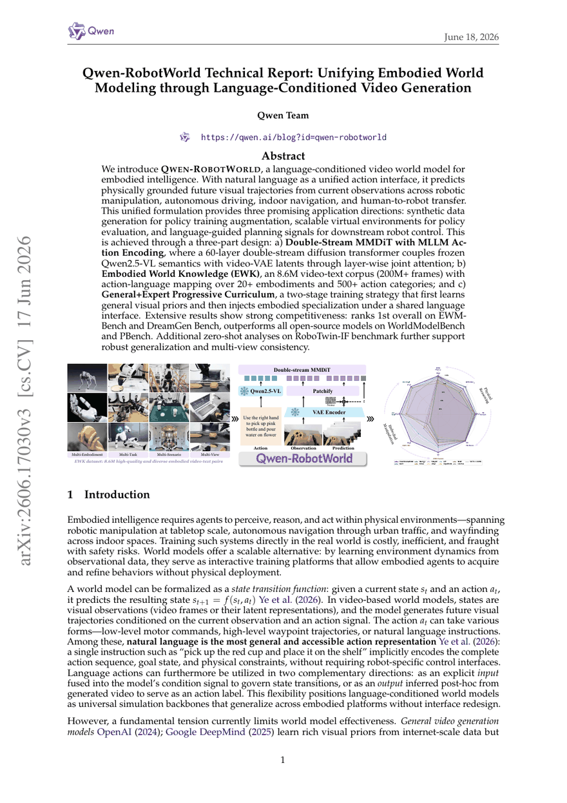
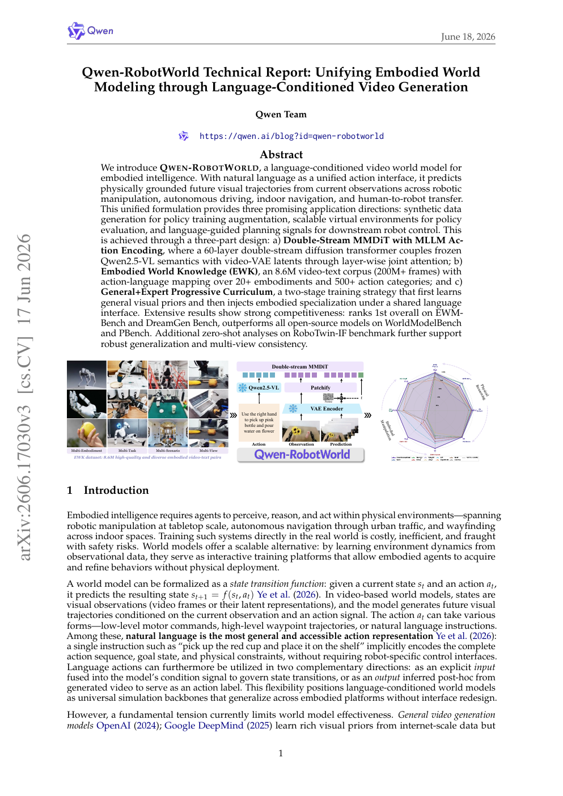
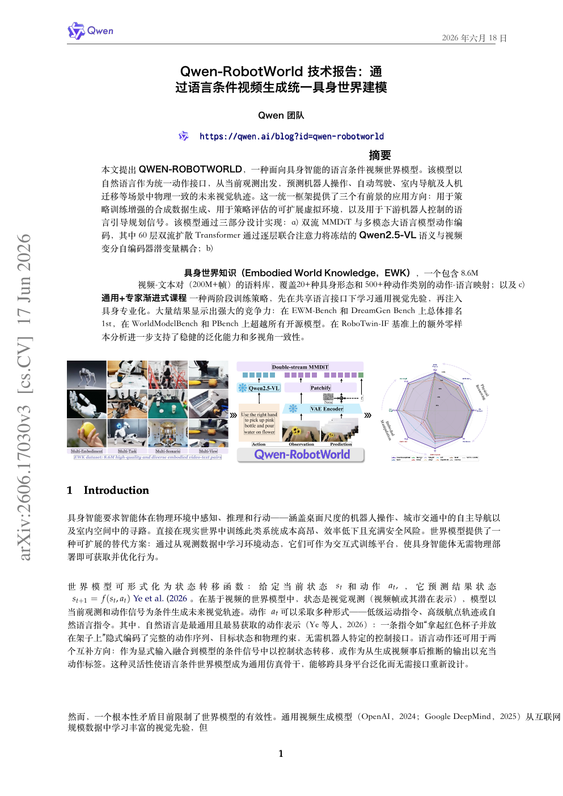
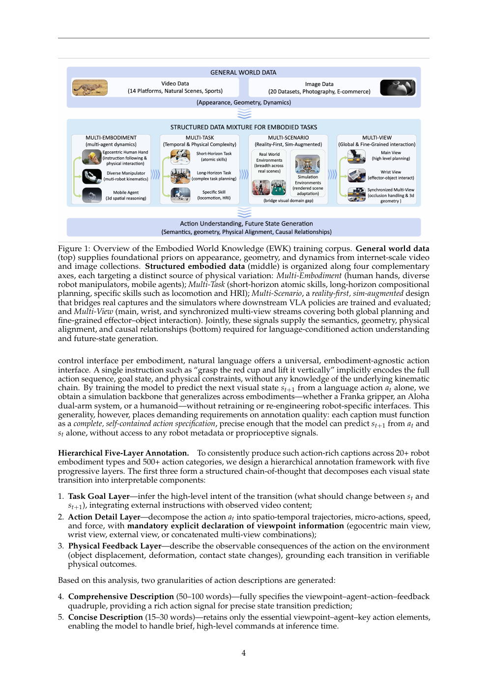
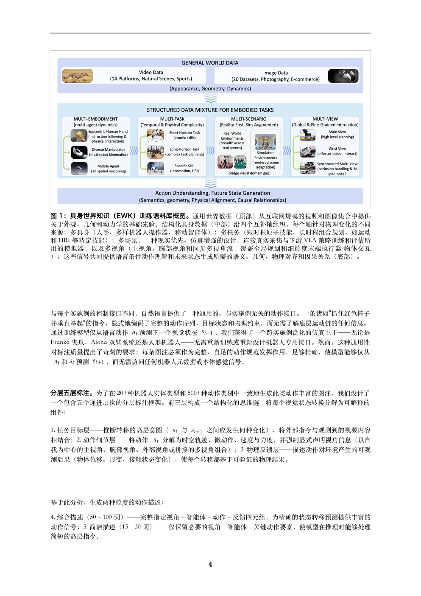
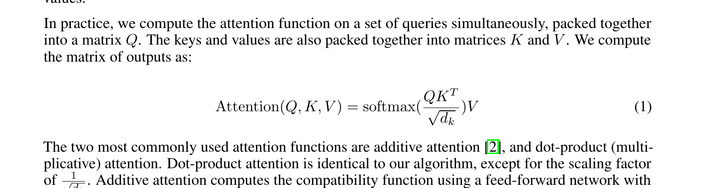
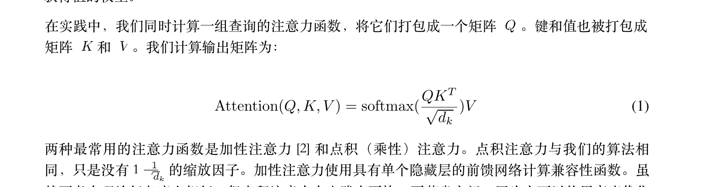
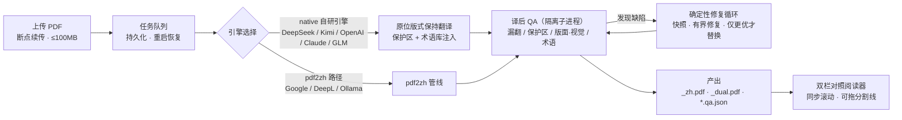

# SuperTranslate

中文 | [English](README_en.md)

[](https://github.com/asimfish/super_translate/actions/workflows/ci.yml)
[](LICENSE)
[](pyproject.toml)
[](https://github.com/asimfish/super_translate/stargazers)

**保版式学术论文 PDF 翻译系统**：直接在原版 PDF 上做英→中翻译，公式、图表、表格、双栏排版零破坏；每一次翻译都产出机器可读的 QA 审计报告。提供两种用法——**Web 应用**（FastAPI + 内置双栏对照阅读器）与 **Agent Skill**（Claude Code / Cursor 里一句话触发）。



## 目录

1. [为什么做这个](#为什么做这个)
2. [翻译效果对比](#翻译效果对比)
3. [特性](#特性)
4. [架构](#架构)
5. [快速开始 · Web 模式](#快速开始--web-模式)
6. [快速开始 · Agent Skill 模式](#快速开始--agent-skill-模式)
7. [命令行](#命令行)
8. [质量保障](#质量保障)
9. [基准集](#基准集)
10. [支持的翻译后端](#支持的翻译后端)
11. [FAQ](#faq)
12. [Roadmap](#roadmap)
13. [License 与引用](#license-与引用)

## 为什么做这个

读英文论文的人每天都在重复同一套动作：左边开原文，右边开翻译工具，来回对照。而现有工具在学术 PDF 上各有各的塌法：

- **粘贴进对话式 AI**：得到一段纯文本，版式、公式、图表、交叉引用全部丢失；
- **浏览器翻译插件**：为网页设计，PDF 的双栏与行内公式常被打散串行；
- **在线文档翻译**：版式近似还原，但公式没有专门保护，容易被当普通文本改写。

学术 PDF 恰恰是版式最密集的文体——编号公式、算法伪代码、双栏排版、图注表格、参考文献，翻坏任何一处都直接影响可读性与可信度。

SuperTranslate 的三条设计原则：

1. **不重排版面**。自研 native 引擎在原 PDF 上原位替换文本，页面尺寸、图像、矢量图形、文本块位置全部保持；公式、表格、算法伪代码、引用标记 `[1][2]` 划入保护区，原样保留。
2. **翻完必须自证**。每次翻译后自动运行 QA：漏翻检测、保护区改动检测（连实验数字被篡改都能查出）、文本重叠、图片丢失、视觉回归、术语一致性，结果写入 `*.qa.json`。
3. **不达标不算完成**。确定性质量循环对缺陷做有界修复，候选结果只有在错误分数严格改善时才会替换旧输出，否则回滚快照。

## 翻译效果对比

两列并排：**左原文，右 SuperTranslate 译文**，点击图片查看原始分辨率。所有对比图直接从真实翻译产物渲染（`pdftoppm`，整页 120 DPI、局部放大 240 DPI）；保版式翻译不改变页面几何，同一位置左右直接可比。素材清单与证据指针见 [docs/assets/comparison/manifest.json](docs/assets/comparison/manifest.json)。

### Qwen-RobotWorld Technical Report（25 页 · CC BY 4.0）

<table>
  <tr>
    <th width="50%">原文</th>
    <th width="50%">SuperTranslate</th>
  </tr>
  <tr>
    <td><a href="docs/assets/comparison/qwen_robotworld/original_p1.png"></a></td>
    <td><a href="docs/assets/comparison/qwen_robotworld/ours_p1.png"></a></td>
  </tr>
  <tr>
    <td><a href="docs/assets/comparison/qwen_robotworld/original_p4.png"></a></td>
    <td><a href="docs/assets/comparison/qwen_robotworld/ours_p4.png"></a></td>
  </tr>
</table>

**看什么**：第 1 页的标题、摘要与管线彩图——品牌元素、链接、arXiv 侧边栏完整保留；第 4 页的大型数据混合结构图——图注译为中文，行内数学符号 `s_t`、`a_t`、`s_{t+1}` 原样保留，验证复杂图文混排。

### Cosmos World Foundation Model（75 页 · CC BY 4.0）

<table>
  <tr>
    <th width="50%">原文</th>
    <th width="50%">SuperTranslate</th>
  </tr>
  <tr>
    <td><a href="docs/assets/comparison/cosmos/original_p1.png"></a></td>
    <td><a href="docs/assets/comparison/cosmos/ours_p1.png"></a></td>
  </tr>
  <tr>
    <td><a href="docs/assets/comparison/cosmos/original_p34.png"></a></td>
    <td><a href="docs/assets/comparison/cosmos/ours_p34.png"></a></td>
  </tr>
</table>

<table>
  <tr>
    <td align="center" width="50%"><a href="docs/assets/comparison/cosmos/crop_figure_original.png"></a><br/><sub>局部放大 · 原文：第 34 页图 17 下半组（240 DPI）</sub></td>
    <td align="center" width="50%"><a href="docs/assets/comparison/cosmos/crop_figure_ours.png"></a><br/><sub>局部放大 · 译文：帧网格原样，Prompt 说明与加粗图注译为中文</sub></td>
  </tr>
</table>

**看什么**：第 34 页已在这份 75 页 NVIDIA 技术报告的深处——图 17 视频帧网格（4B/12B/5B/13B 四行）原样保留，Prompt 说明段落与加粗图注译为中文，长文档后段质量不衰减。这篇论文的发布验收通过逐对象审计：**75/75 页、793 个翻译对象、0 缺陷**（详见[质量保障](#质量保障)）。

### 经典论文：局部放大对比（Attention / ResNet）

Attention Is All You Need 与 ResNet 采用 arXiv 非独占许可（非 CC），按下方[展示政策](#展示政策)只展示小幅局部对比与聚合指标，不公开整页译文。

<table>
  <tr>
    <td align="center" width="50%"><a href="docs/assets/comparison/attention/crop_formula_original.png"></a><br/><sub>Attention · 公式(1) 区域 · 原文</sub></td>
    <td align="center" width="50%"><a href="docs/assets/comparison/attention/crop_formula_ours.png"></a><br/><sub>Attention · 公式(1) 区域 · 译文（公式原样保留）</sub></td>
  </tr>
  <tr>
    <td align="center"><a href="docs/assets/comparison/attention/crop_figure_original.png"></a><br/><sub>Attention · 图 2 注意力结构图 · 原文</sub></td>
    <td align="center"><a href="docs/assets/comparison/attention/crop_figure_ours.png"></a><br/><sub>Attention · 图 2 注意力结构图 · 译文（图内文字保留，图注翻译）</sub></td>
  </tr>
  <tr>
    <td align="center"><a href="docs/assets/comparison/resnet/crop_twocol_original.png"></a><br/><sub>ResNet · 双栏首屏 · 原文</sub></td>
    <td align="center"><a href="docs/assets/comparison/resnet/crop_twocol_ours.png"></a><br/><sub>ResNet · 双栏首屏 · 译文（标题/摘要/图 1 排版原位）</sub></td>
  </tr>
</table>

批次指标（classic20 r2 批次，20/20 完成；翻译模型 `deepseek-v4-pro`，quality 档，迭代 QA）：

| 论文 | 页数 | 视觉评分 | 错误级缺陷 | 严格门禁 | 翻译耗时 |
|---|---|---|---|---|---|
| Attention Is All You Need | 15 | 0.9041 | 0 | 通过 | 135.1s |
| Deep Residual Learning (ResNet) | 12 | 0.8621 | 0 | 通过 | 240.2s |

两篇均无错误级缺陷，仅有不阻断门禁的版面风险提示（`high_risk_layout`）；视觉评分为渲染墨迹相似度，严格门禁过线为 ≥ 0.55。

### 展示政策

对比素材遵循 [benchmarks/classic20/README.md](benchmarks/classic20/README.md) 的许可政策：**仅 Creative Commons 许可的论文公开展示完整翻译页**（本节的 Qwen-RobotWorld 与 Cosmos 均为 CC BY 4.0）；arXiv 非独占许可的论文只展示小幅局部 crop 与聚合指标。基准 `showcase_cc` 组的六篇 CC 许可经典论文（LLaMA / Mistral / Mamba / DPO / CoT / vLLM）翻译产物就绪后，将补充为完整页对比。

### 工具能力矩阵

| 能力 | SuperTranslate | pdf2zh (PDFMathTranslate) | 沉浸式翻译 | Google 翻译（文档） | GPT / Kimi 粘贴翻译 |
|---|---|---|---|---|---|
| 版式保持（原位替换） | ● 页面尺寸/图像/文本块位置原样保持 | ● 以保留版式为目标¹ | ◐ 对照式输出为主¹ | ◐ 近似还原¹ | ○ 纯文本输出 |
| 公式完整性 | ● 保护区原样保留 + QA 二次核验 | ● 声明保留公式¹ | ◐ 未见专门机制¹ | ○ 无专门保护¹ | ○ 易丢失或乱码 |
| 图表处理 | ● 图内文字默认保护，图注翻译 | ● 声明保留图表¹ | ◐ 视文档类型而定¹ | ◐ 图片不翻译¹ | ○ 无法处理 |
| 双栏排版 | ● 双栏为基准集固定覆盖轴 | ● 支持¹ | ◐ 效果视 PDF 而定¹ | ◐ 未见专门说明¹ | ○ 不适用 |
| 长文档（75 页级） | ● Cosmos 75 页实测全对象通过 | ◐ 未见长文档承诺¹ | ◐ 未见专门说明¹ | ◐ 有文件大小限制¹ | ○ 受上下文长度限制 |
| 本地部署 | ● Docker / uv 自托管 | ● 支持本地运行¹ | ○ 浏览器扩展 + 云服务¹ | ○ 云服务 | ○ 云服务 |
| 批量处理 | ● Web 多篇并行 + 治理型批处理脚本 | ● 提供 CLI¹ | ◐ 逐份操作为主¹ | ○ 逐份上传 | ○ 手动粘贴 |
| 译后 QA 审计 | ● 对象级审计 + 视觉评分 + `*.qa.json` | ○ 未见内置译后审计¹ | ○ 未见¹ | ○ 无 | ○ 无 |
| 开源 | ● AGPL-3.0 | ● AGPL-3.0¹ | ◐ 扩展本体闭源¹ | ○ 闭源 | ○ 闭源 |

●&nbsp;完整支持&nbsp;&nbsp;◐&nbsp;部分/视情况&nbsp;&nbsp;○&nbsp;无或不适用

> ¹ 对其他工具的描述基于各自公开文档与产品页（2026-08 查阅），能力可能随版本变化，如有出入欢迎提 issue 指正。
>
> 诚实说明：上文对比图暂无 pdf2zh 的同机图像基线——制图环境的 I/O 限制导致 pdf2zh 未能在时限内完成运行（记录见 [docs/assets/comparison/NOTES.md](docs/assets/comparison/NOTES.md)），本表仅为基于公开文档的文字性对比，欢迎社区提交对比样张。

## 特性

**翻译引擎**

- **原位版式保持**：native 引擎保持原页面尺寸、图像、矢量图形与文本块位置，不重排、不重构页面
- **保护区机制**：公式、表格、算法伪代码、参考文献、引用标记 `[1][2]` 原样保留；图内文字默认保护（可选翻译图内可编辑文本）
- **纯中文输出**：术语首次出现给出「中文术语（English Term）」，之后统一用中文；粗体/斜体/标题层级保留
- **术语一致性**：内置 1,000+ 条术语库（NeurIPS / ICML / ICLR / CVPR / ACL 等顶会分轨术语 + CS/ML/数学基础词表），翻译时注入提示词，译后审计是否使用标准译法，`corpus-lint` 作为 CI 门禁
- **双输出**：`_zh.pdf`（纯中文）+ `_dual.pdf`（原文/译文对照）
- **OCR 后备**：扫描版（纯图片）PDF 可先 OCR 再翻译（基于 Tesseract）

**质量与可靠性**

- **译后 QA**：漏翻、保护区改动（含实验数字被篡改）、文本重叠、图片/矢量图/公式丢失、空白页、视觉回归、术语一致性；报告写入机器可读的 `*.qa.json`
- **确定性修复循环**：单轮或迭代模式，快照 + 有界修复 + 全检测器重跑，仅当错误分数严格改善才替换输出
- **任务持久化**：任务历史、心跳、取消、进度实时推送；进程重启后排队任务自动重新调度，修不好的任务保留最佳产物并标记 `repair_pending`
- **断点续传上传**：8 MiB 以上 PDF 自动分块（4 MiB/块，SHA256 校验），代理中断可续传，按内容哈希去重（单文件上限 100 MB）

**部署与协作**

- **多 LLM 后端**：DeepSeek / Kimi K3 / OpenAI（及兼容端点）/ Anthropic Claude / GLM / Google / DeepL / Ollama，详见[支持的翻译后端](#支持的翻译后端)
- **按用户加密的 API Key**：每个账号的密钥 AES-GCM 加密存储，不回传浏览器、不写入任务文件
- **多用户与隔离**：用户名密码账号（PBKDF2）、workspace token 轻量隔离、API bearer token、内置限流
- **双栏对照阅读器**：原文/译文同步滚动，分割线可拖动，暗色主题，移动端自适应
- **基准展示页**：`/showcase` 只读展示基准指标与 CC 许可论文的翻译预览
- **飞书通知**：翻译完成 webhook 推送

## 架构



两条翻译路径：

- **native 自研引擎**（默认，`PAPER_CHINA_TRANSLATION_ENGINE=native`）：版式保持、保护区、术语注入、QA 修复循环的完整能力，供 DeepSeek / Kimi / OpenAI / Anthropic / GLM 使用。Kimi / Anthropic / GLM 强制走 native 引擎。
- **pdf2zh 路径**：复用捆绑的 [pdf2zh (PDFMathTranslate)](https://github.com/Byaidu/PDFMathTranslate) 管线，支撑 Google（免 API key 的 `fast` 档）、DeepL、Ollama 本地模型。

设计决策记录见 [docs/ARCHITECTURE.md](docs/ARCHITECTURE.md) 与 [docs/adr/](docs/adr/)。

## 快速开始 · Web 模式

### 方式一：Docker Compose（部署为网站）

```bash
git clone https://github.com/asimfish/super_translate.git
cd super_translate

cp .env.example .env
# 编辑 .env：
#   PAPER_CHINA_CREDENTIAL_ENCRYPTION_KEY —— 必填，生成：openssl rand -base64 32 | tr '+/' '-_'
#   PAPER_CHINA_API_TOKEN               —— 公网部署必填的访问令牌
# 编辑 Caddyfile，把 your-domain.example.com 换成你的域名

docker compose up -d --build
```

打开 `https://你的域名`，首次访问输入 API token，登录后在「API 设置」里填入所选后端的 key 即可翻译。健康检查：`curl https://你的域名/health`。

只在内网用、没有域名？跳过 Caddy 只起应用：`docker compose up -d app`（监听 `127.0.0.1:8000`，配合 SSH 隧道访问）。完整教程（VPS + HTTPS + 备份 + 故障排查）见 [docs/DEPLOYMENT.md](docs/DEPLOYMENT.md)。

### 方式二：uv（本机运行）

```bash
git clone https://github.com/asimfish/super_translate.git
cd super_translate

uv sync
export PAPER_CHINA_DEEPSEEK_API_KEY="你的 DeepSeek API Key"
uv run uvicorn app.main:app --host 127.0.0.1 --port 8001
```

浏览器打开 <http://localhost:8001>。本机回环访问无需配置 token。没有 uv 的话，`python3 -m venv .venv && source .venv/bin/activate && pip install -e .` 效果等同；参与开发（含测试依赖）用 `uv sync --extra dev`，见 [CONTRIBUTING.md](CONTRIBUTING.md)。

日常使用（上传、选后端、看进度、双栏阅读、下载）见中文教程 [docs/TUTORIAL.zh-CN.md](docs/TUTORIAL.zh-CN.md)。

## 快速开始 · Agent Skill 模式

仓库自带 `paper-translate` skill（[skills/paper-translate/SKILL.md](skills/paper-translate/SKILL.md)），让 Claude Code / Cursor 等编码 Agent 直接驱动翻译引擎，并按 skill 内置的质量门禁自动跑 QA。

```bash
# 先完成本仓库安装（见上文 uv 方式），然后把 skill 复制到你的 Agent 技能目录：

# Claude Code（全局生效）
mkdir -p ~/.claude/skills && cp -r skills/paper-translate ~/.claude/skills/

# Cursor（当前工作区生效）
mkdir -p .cursor/skills && cp -r skills/paper-translate .cursor/skills/
```

然后在对话里一句话触发：

> 用 paper-translate 把 ~/Papers/attention.pdf 翻译成中文，保留版式并跑严格 QA。

Skill 会自动完成：术语库预检 → native 引擎翻译（含翻译缓存）→ 文本/视觉双重 QA → 汇报源文件与产物哈希、QA 计数与视觉评分。

## 命令行

Web 与 Skill 之外，引擎本身可以直接从命令行调用（批量脚本、CI 集成）：

```bash
uv run python -m pdf_zh_translator translate \
  paper.pdf paper_zh.pdf \
  --api-mode deepseek \
  --api-key-env PAPER_CHINA_DEEPSEEK_API_KEY \
  --preserve-graphics-text \
  --cache-file paper_zh.translation-cache.jsonl
```

- `--api-mode`：`deepseek`（默认，模型 `deepseek-v4-pro`）/ `openai-compatible`（配 `--api-url` 与 `--model`，可接 Kimi、GLM 等任意兼容端点）/ `generic` / `cache-only`
- `--api-key-env`：传环境变量名而不是明文 key，避免密钥进入命令行历史
- `--cache-file`：块级翻译缓存；重跑时已翻内容不再计费，`--api-mode cache-only` 可离线确定性重放
- 译后核验：`uv run python -m pdf_zh_translator inspect 原文.pdf 译文.pdf --json-out 报告.json`

全部子命令（术语库管理、golden 回归、版式模板学习等）：`uv run python -m pdf_zh_translator --help`。

## 质量保障

「翻译成功生成 PDF」只是中间结果，这个项目把大部分工程量花在证明「没有翻坏」上。

**测试体系**（`tests/`，35 个测试文件、1,855 个测试用例，`pytest --collect-only` 实收）：

- **引擎单测与定点回归**：针对具体缺陷类别的 PDF fixture（版式修复、保护区、行距、装订线、清洗器等）
- **Golden pages**：锁定字体/平台变体下的逐页渲染结果，防止版式回归
- **对象级 QA**：`verify_translation_issues` 全量文本层检查 + 页面视觉检查器（字号漂移、公式裁切、表格网格错位、参考文献重印等）
- **视觉 QA**：`score_visual_layout` 基于渲染的墨迹相似度评分
- **Web 层与端到端**：API、断点续传、任务恢复、凭据加密、限流，以及 Playwright 真浏览器 E2E

CI（[.github/workflows/ci.yml](.github/workflows/ci.yml)）每次提交在 Python 3.13 上跑 `ruff` 静态检查、术语库 `corpus-lint --strict` 与轻量翻译冒烟（`scripts/smoke_test.sh`）；全量测试套件本地执行 `uv run pytest`，约定见 [CONTRIBUTING.md](CONTRIBUTING.md)。

**实测数字**（均有产物证据，方法见[基准集](#基准集)）：

| 指标 | 数值 | 说明 |
|---|---|---|
| 长文档逐对象审计 | **75/75 页 · 793 对象 · 0 缺陷** | Cosmos（arXiv 2501.03575，75 页）发布验收，对象级审计策略 `object-qa-2026.08-v1`，逐对象核对标题/摘要/正文/图注的翻译与保护区完整性 |
| 单篇严格门禁 | 0 错误级缺陷 + 0 可执行警告 + 视觉分 ≥ 0.55 | 另要求页数一致、无空白页、无图片/矢量图/公式丢失 |
| 公开展示门槛 | ≥ 20 篇 strict pass | 基准 gate 不达标即拒绝发布展示 |

基准产物是内容寻址的：源 PDF SHA-256、译文 SHA-256、QA 代码指纹、引擎与字体指纹全部记录，术语库或提示词变更会强制重建而不是复用旧产物。

## 基准集

### classic20（发布基准）

[benchmarks/classic20/manifest.json](benchmarks/classic20/manifest.json) 固化 **50 篇论文**：25 篇里程碑经典 + 7 篇经典扩充 + 6 篇 CC 许可展示集 + 12 篇近期压力测试，覆盖 10 个版式轴（单栏/双栏、公式密集、算法块、表格密集、图密集、长参考文献、附录密集、短文/长文）。

```bash
uv run python scripts/classic_benchmark.py fetch
uv run python scripts/classic_benchmark.py translate --isolate   # 需要 DEEPSEEK_API_KEY
uv run python scripts/classic_benchmark.py evaluate
uv run python scripts/classic_benchmark.py report
uv run python scripts/classic_benchmark.py gate
```

每步可续跑；多篇翻译自动为每篇分配独立解释器进程；工作目录有 OS 级排他锁。**许可政策**：只有 Creative Commons 许可的论文才会在公开展示中放出完整翻译页面，arXiv 非独占许可的论文仅贡献聚合指标。详见 [benchmarks/classic20/README.md](benchmarks/classic20/README.md)。

### worldmodel10（验收集）

[benchmarks/classic20/worldmodel10.json](benchmarks/classic20/worldmodel10.json) 固化 10 篇 2025–2026 年世界模型方向论文（视频/机器人/人形/物理 AI），从 6 页短文到 75 页的 Cosmos 技术报告，全部用带版本号的 arXiv ID 冻结源文件修订，10 篇中 8 篇为 CC BY 4.0。

## 支持的翻译后端

| 后端 | 引擎路径 | API Key | 说明 |
|---|---|---|---|
| DeepSeek | native | 需要 | 默认后端，默认模型 `deepseek-v4-pro` |
| Kimi K3 | native（强制） | 需要 | Moonshot OpenAI 兼容端点 |
| OpenAI 及兼容端点 | native | 需要 | 可自定义 `OPENAI_BASE_URL` / `OPENAI_MODEL` |
| Anthropic Claude | native（强制） | 需要 | |
| GLM | native（强制） | 需要 | |
| Google 翻译 | pdf2zh | 免 key | 即 `fast` 质量档，速度优先 |
| DeepL | pdf2zh | 需要 | |
| Ollama | pdf2zh | 免 key | 本地模型，配 `OLLAMA_HOST` |

Web 界面还提供三个质量档：`fast`（Google，免 key）/ `balanced`（默认，DeepSeek）/ `quality`（DeepSeek 全量选项 + 定制学术提示词）。「API 设置」页展示离线核验的模型目录（最新/质量/均衡/经济分组），保存 key 后还会拉取该账号实际可用的模型列表。目录维护规则见 [docs/PROVIDER_MODEL_CATALOG.md](docs/PROVIDER_MODEL_CATALOG.md)。

## FAQ

**中文字体从哪来？**
引擎自动发现系统字体（Docker 镜像内置 `fonts-noto-cjk`），也可用 `PDF_ZH_FONT_FILE` 指定任意 TTF/OTF。输出 PDF 做字体子集化嵌入，避免文件膨胀；选中的字体文件会被指纹化记录，保证可复现。

**必须要 API key 吗？**
Google 后端（`fast` 档）免 key 可直接用；其余后端各自需要 key。Web 部署下每个用户在「API 设置」里填自己的 key（AES-GCM 加密存储，不回传浏览器），服务器级环境变量仅作为管理员回退。

**翻译一篇论文要多久、花多少钱？**
取决于后端与篇幅：单任务默认超时 30 分钟（可调）。块级翻译缓存保证重试时已完成部分不重复计费；限速 key 建议设 `PAPER_CHINA_TRANSLATION_CONCURRENCY=1`。

**扫描版（纯图片）PDF 能翻吗？**
能。上传时开启 OCR 选项即可（服务器需装 Tesseract 语言数据）。注意：烧在位图里的文字无法原位替换。

**数据隐私如何保证？**
完全自托管：PDF、译文、数据库都在本机 `data/` 目录；对外网络请求只有你所选翻译后端的 API 调用。搭配 Ollama 后端可以做到完全离线。公网部署强制 bearer token，支持按 workspace 隔离论文库。

**公式或实验数字会被翻坏吗？**
公式、表格、算法伪代码、参考文献属于保护区，原样保留；译后 QA 还会逐一核验保护区内容未被改动——连数值被悄悄改写都会报错。

**为什么只能跑单个 worker？**
翻译队列、并发限制与取消状态是进程内的。多 worker 会放大并发上限并打散取消状态，所以扩容方式是调高进程内并发，而不是加副本。多用户重负载场景的方向是 PostgreSQL + 外部任务队列（见 Roadmap）。

**为什么包名和环境变量前缀是 `paper-china` / `PAPER_CHINA_`？**
历史原因——项目早期内部代号，保留是为了兼容既有部署的配置。

## Roadmap

以下方向来自仓库内已有文档与代码基础，不承诺时间线：

- **基准集持续扩充**：classic20 定位为「growing set」，覆盖更多版式轴与近期论文
- **展示站**：`/showcase` 端点与预览产物已内置，项目主页与在线对比展示建设中
- **规模化部署路径**：面向多用户重负载的 PostgreSQL + 外部任务队列迁移（当前定位单机/小团队）
- **模型目录跟随更新**：按 [PROVIDER_MODEL_CATALOG](docs/PROVIDER_MODEL_CATALOG.md) 的维护规则持续核验各家新模型
- **版式模板库**：`layout-learn` 已支持从代表性 PDF 学习 ACM/IEEE/Springer/ACL 风格的版式 profile，逐步沉淀为内置模板

## License 与引用

[AGPL-3.0-or-later](LICENSE)。

**为什么是 AGPL**：本项目捆绑并导入 [pdf2zh (PDFMathTranslate)](https://github.com/Byaidu/PDFMathTranslate) 与 [PyMuPDF](https://github.com/pymupdf/PyMuPDF)，二者均为 AGPL-3.0，整个项目因此必须以 AGPL-3.0 分发。这意味着：如果你把修改过的版本作为网络服务运行，必须向用户提供对应源码——Web 界面里的「源码」链接就是为此保留的，请让它指向与你运行代码一致的仓库。

学术引用：

```bibtex
@software{supertranslate2026,
  title   = {SuperTranslate: Layout-Preserving Academic PDF Translation},
  author  = {{SuperTranslate Contributors}},
  year    = {2026},
  url     = {https://github.com/asimfish/super_translate},
  license = {AGPL-3.0-or-later}
}
```
