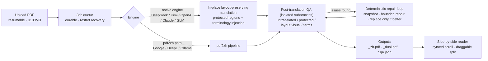

# SuperTranslate

[中文](README.md) | English

[](https://github.com/asimfish/super_translate/actions/workflows/ci.yml)
[](LICENSE)
[](pyproject.toml)
[](https://github.com/asimfish/super_translate/stargazers)

**Layout-preserving academic PDF translation** (English → Chinese): translation happens in place on the original PDF, with zero damage to formulas, figures, tables, and two-column layouts — and every run ships a machine-readable QA audit report. Two ways to use it: a **web app** (FastAPI + built-in side-by-side reader) and an **agent skill** (one sentence in Claude Code / Cursor).


## Contents

1. [Why This Exists](#why-this-exists)
2. [Translation Quality, Side by Side](#translation-quality-side-by-side)
3. [Features](#features)
4. [Architecture](#architecture)
5. [Quick Start: Web Mode](#quick-start-web-mode)
6. [Quick Start: Agent Skill Mode](#quick-start-agent-skill-mode)
7. [Command Line](#command-line)
8. [Quality Assurance](#quality-assurance)
9. [Benchmarks](#benchmarks)
10. [Supported Translation Backends](#supported-translation-backends)
11. [FAQ](#faq)
12. [Roadmap](#roadmap)
13. [License and Citation](#license-and-citation)

## Why This Exists

Reading papers in a second language means endlessly hopping between the original PDF and a translator. And existing tools each fail on academic PDFs in their own way:

- **Pasting into a chat AI** returns plain text — layout, formulas, figures, and cross-references are all gone;
- **Browser translation extensions** are built for web pages; two-column PDFs and inline math routinely get scrambled;
- **Online document translators** approximate the layout but have no special handling for math, which gets rewritten as if it were prose.

Academic PDFs are the most layout-dense documents there are — numbered equations, algorithm blocks, two-column typesetting, captions, references. Breaking any of them hurts both readability and trust.

SuperTranslate follows three design rules:

1. **Never re-flow the page.** The in-house native engine replaces text in place on the original PDF; page dimensions, images, vector graphics, and text-block positions are all preserved. Formulas, tables, algorithm pseudo-code, and citation markers `[1][2]` are treated as protected regions and left untouched.
2. **Every run must prove itself.** Post-translation QA checks for untranslated prose, tampered protected regions (even a silently altered experimental number is caught), text overlap, missing images, visual regressions, and terminology consistency — all written to a machine-readable `*.qa.json` sidecar.
3. **Not clean means not done.** A deterministic quality loop applies bounded repairs; a candidate output replaces the previous one only when its error score strictly improves, otherwise the snapshot is restored.

## Translation Quality, Side by Side

Two columns: **original on the left, SuperTranslate output on the right** — click any image for full resolution. All comparison images are rendered directly from real translation artifacts (`pdftoppm`, full pages at 120 DPI, close-ups at 240 DPI); since layout-preserving translation keeps page geometry unchanged, the same spot on both sides is directly comparable. The asset inventory and evidence pointers live in [docs/assets/comparison/manifest.json](docs/assets/comparison/manifest.json).

### Qwen-RobotWorld Technical Report (25 pages, CC BY 4.0)

<table>
  <tr>
    <th width="50%">Original</th>
    <th width="50%">SuperTranslate</th>
  </tr>
  <tr>
    <td><a href="docs/assets/comparison/qwen_robotworld/original_p1.png"></a></td>
    <td><a href="docs/assets/comparison/qwen_robotworld/ours_p1.png"></a></td>
  </tr>
  <tr>
    <td><a href="docs/assets/comparison/qwen_robotworld/original_p4.png"></a></td>
    <td><a href="docs/assets/comparison/qwen_robotworld/ours_p4.png"></a></td>
  </tr>
</table>

**What to look for**: on page 1, the title, abstract, and pipeline artwork — branding, links, and the arXiv sidebar all intact; on page 4, the large data-mixture diagram — captions translated into Chinese while inline math symbols `s_t`, `a_t`, `s_{t+1}` are preserved as-is, exercising dense mixed figure-and-text layout.

### Cosmos World Foundation Model (75 pages, CC BY 4.0)

<table>
  <tr>
    <th width="50%">Original</th>
    <th width="50%">SuperTranslate</th>
  </tr>
  <tr>
    <td><a href="docs/assets/comparison/cosmos/original_p1.png"></a></td>
    <td><a href="docs/assets/comparison/cosmos/ours_p1.png"></a></td>
  </tr>
  <tr>
    <td><a href="docs/assets/comparison/cosmos/original_p34.png"></a></td>
    <td><a href="docs/assets/comparison/cosmos/ours_p34.png"></a></td>
  </tr>
</table>

<table>
  <tr>
    <td align="center" width="50%"><a href="docs/assets/comparison/cosmos/crop_figure_original.png"></a><br/><sub>Close-up, original: lower half of Figure 17 on page 34 (240 DPI)</sub></td>
    <td align="center" width="50%"><a href="docs/assets/comparison/cosmos/crop_figure_ours.png"></a><br/><sub>Close-up, translation: frame grid untouched; prompt text and bold caption in Chinese</sub></td>
  </tr>
</table>

**What to look for**: page 34 sits deep inside this 75-page NVIDIA technical report — the Figure 17 video-frame grid (4B/12B/5B/13B rows) is untouched while the prompt paragraphs and bold captions are translated, showing that quality does not decay in the depths of a long document. This paper's release acceptance passed a per-object audit: **75/75 pages, 793 translation objects, 0 issues** (see [Quality Assurance](#quality-assurance)).

### Classic Papers: Close-Up Comparisons (Attention / ResNet)

Attention Is All You Need and ResNet are distributed under the arXiv non-exclusive license (not CC), so per the [display policy](#display-policy) below only small close-up crops and aggregate metrics are shown — no full translated pages.

<table>
  <tr>
    <td align="center" width="50%"><a href="docs/assets/comparison/attention/crop_formula_original.png"></a><br/><sub>Attention · Equation (1) region · original</sub></td>
    <td align="center" width="50%"><a href="docs/assets/comparison/attention/crop_formula_ours.png"></a><br/><sub>Attention · Equation (1) region · translation (formula untouched)</sub></td>
  </tr>
  <tr>
    <td align="center"><a href="docs/assets/comparison/attention/crop_figure_original.png"></a><br/><sub>Attention · Figure 2 attention diagrams · original</sub></td>
    <td align="center"><a href="docs/assets/comparison/attention/crop_figure_ours.png"></a><br/><sub>Attention · Figure 2 attention diagrams · translation (figure text preserved, caption translated)</sub></td>
  </tr>
  <tr>
    <td align="center"><a href="docs/assets/comparison/resnet/crop_twocol_original.png"></a><br/><sub>ResNet · two-column top half · original</sub></td>
    <td align="center"><a href="docs/assets/comparison/resnet/crop_twocol_ours.png"></a><br/><sub>ResNet · two-column top half · translation (title/abstract/Figure 1 in place)</sub></td>
  </tr>
</table>

Batch metrics (classic20 r2 batch, 20/20 completed; model `deepseek-v4-pro`, quality preset, iterative QA):

| Paper | Pages | Visual score | Error-severity issues | Strict gate | Translation time |
|---|---|---|---|---|---|
| Attention Is All You Need | 15 | 0.9041 | 0 | pass | 135.1s |
| Deep Residual Learning (ResNet) | 12 | 0.8621 | 0 | pass | 240.2s |

Neither paper has error-severity issues; the only findings are non-blocking layout-risk advisories (`high_risk_layout`). The visual score is render-based ink similarity; the strict gate requires ≥ 0.55.

### Display Policy

Comparison assets follow the licensing policy of [benchmarks/classic20/README.md](benchmarks/classic20/README.md): **only Creative Commons licensed papers get full translated pages in public** (Qwen-RobotWorld and Cosmos in this section are both CC BY 4.0); papers under the arXiv non-exclusive license are shown only as small close-up crops plus aggregate metrics. Once translations of the six CC-licensed classics in the benchmark's `showcase_cc` group (LLaMA / Mistral / Mamba / DPO / CoT / vLLM) are ready, they will be added as full-page comparisons.

### Capability Matrix

| Capability | SuperTranslate | pdf2zh (PDFMathTranslate) | Immersive Translate | Google Translate (documents) | GPT / Kimi copy-paste |
|---|---|---|---|---|---|
| Layout preservation (in-place) | ● keeps page size / images / text-block positions | ● stated goal¹ | ◐ primarily side-by-side output¹ | ◐ approximate¹ | ○ plain text |
| Formula integrity | ● protected regions + QA re-verification | ● claims formula preservation¹ | ◐ no dedicated mechanism found¹ | ○ no special handling¹ | ○ easily lost or garbled |
| Figures and tables | ● figure text protected by default, captions translated | ● claims chart preservation¹ | ◐ depends on document type¹ | ◐ images not translated¹ | ○ not applicable |
| Two-column layouts | ● a fixed coverage axis in the benchmark | ● supported¹ | ◐ varies by PDF¹ | ◐ no specific claims found¹ | ○ not applicable |
| Long documents (75-page class) | ● Cosmos 75 pages, all objects audited | ◐ no long-document claims found¹ | ◐ no specific claims found¹ | ◐ file-size limits¹ | ○ context-length bound |
| Self-hosting | ● Docker / uv | ● local runs supported¹ | ○ browser extension + cloud¹ | ○ cloud service | ○ cloud service |
| Batch processing | ● parallel web jobs + governed batch harness | ● CLI available¹ | ◐ mostly per-document¹ | ○ per-document upload | ○ manual pasting |
| Post-translation QA audit | ● object-level audit + visual scoring + `*.qa.json` | ○ no built-in post-run audit found¹ | ○ none found¹ | ○ none | ○ none |
| Open source | ● AGPL-3.0 | ● AGPL-3.0¹ | ◐ extension itself closed-source¹ | ○ closed | ○ closed |

●&nbsp;full&nbsp;&nbsp;◐&nbsp;partial / depends&nbsp;&nbsp;○&nbsp;none / not applicable

> ¹ Descriptions of other tools are based on their public documentation and product pages (checked 2026-08) and may change with versions; corrections are welcome via issues.
>
> Honest note: the comparison images above include no same-machine pdf2zh baseline — I/O constraints in the rendering environment kept pdf2zh from completing within the time budget (see [docs/assets/comparison/NOTES.md](docs/assets/comparison/NOTES.md)). The table above is therefore a documentation-based comparison only; community-contributed side-by-side samples are welcome.

## Features

**Translation engine**

- **In-place layout preservation**: the native engine keeps original page dimensions, images, vector graphics, and text-block positions — no re-flow, no page reconstruction
- **Protected regions**: formulas, tables, algorithm pseudo-code, references, and citation markers `[1][2]` stay untouched; text inside figures is protected by default (optionally translatable)
- **Clean Chinese output**: first occurrence renders as "中文术语（English Term）", then Chinese only; bold/italic/heading structure preserved
- **Terminology consistency**: 1,000+ built-in terms (NeurIPS / ICML / ICLR / CVPR / ACL venue tracks plus CS/ML/math foundations) injected at translation time and audited afterwards, with `corpus-lint` as a CI gate
- **Dual outputs**: `_zh.pdf` (Chinese-only) and `_dual.pdf` (side-by-side original + translation)
- **OCR fallback**: scanned image-only PDFs can be OCR'd before translation (Tesseract-based)

**Quality and reliability**

- **Post-translation QA**: untranslated prose, tampered protected regions (including silently altered experimental numbers), text overlap, missing images/vector graphics/formulas, empty pages, visual regressions, terminology adherence — reported in machine-readable `*.qa.json`
- **Deterministic repair loop**: single-pass or iterative; snapshot + bounded repair + full detector rerun, output replaced only on strict error-score improvement
- **Durable jobs**: history, heartbeat, cancellation, live progress; queued jobs are rescheduled after restarts, and unrepairable jobs keep their best output flagged `repair_pending`
- **Resumable uploads**: PDFs ≥ 8 MiB upload in 4 MiB SHA256-verified chunks, survive proxy interruptions, and deduplicate by content hash (100 MB per-file cap)

**Deployment and collaboration**

- **Multiple LLM backends**: DeepSeek / Kimi K3 / OpenAI (and compatible endpoints) / Anthropic Claude / GLM / Google / DeepL / Ollama — see [Supported Translation Backends](#supported-translation-backends)
- **Per-user encrypted API keys**: AES-GCM at rest, never returned to the browser, never written into job files
- **Multi-user and isolation**: username/password accounts (PBKDF2), lightweight workspace-token isolation, API bearer tokens, built-in rate limiting
- **Side-by-side reader**: synchronized scrolling, draggable split, dark theme, mobile-friendly
- **Benchmark showcase**: a read-only `/showcase` page with benchmark metrics and previews of CC-licensed papers
- **Feishu/Lark notifications**: webhook push when a translation finishes

## Architecture



Two translation paths:

- **Native engine** (default, `PAPER_CHINA_TRANSLATION_ENGINE=native`): the full layout-preservation, protected-region, terminology, and QA-repair capability, used by DeepSeek / Kimi / OpenAI / Anthropic / GLM. Kimi / Anthropic / GLM always run on the native engine.
- **pdf2zh path**: reuses the bundled [pdf2zh (PDFMathTranslate)](https://github.com/Byaidu/PDFMathTranslate) pipeline, powering Google (the key-free `fast` preset), DeepL, and local models via Ollama.

Design decisions are recorded in [docs/ARCHITECTURE.md](docs/ARCHITECTURE.md) and [docs/adr/](docs/adr/).

## Quick Start: Web Mode

### Option A: Docker Compose (deploy as a website)

```bash
git clone https://github.com/asimfish/super_translate.git
cd super_translate

cp .env.example .env
# Edit .env:
#   PAPER_CHINA_CREDENTIAL_ENCRYPTION_KEY — required; generate: openssl rand -base64 32 | tr '+/' '-_'
#   PAPER_CHINA_API_TOKEN                — required for any public deployment
# Edit Caddyfile and replace your-domain.example.com with your domain

docker compose up -d --build
```

Open `https://your-domain`, enter the API token when prompted, log in, and add your provider key under **API Settings**. Health check: `curl https://your-domain/health`.

LAN-only, no domain? Skip Caddy and run just the app: `docker compose up -d app` (listens on `127.0.0.1:8000`; access through an SSH tunnel). Full walkthrough (VPS + HTTPS + backups + troubleshooting): [docs/DEPLOYMENT.md](docs/DEPLOYMENT.md).

### Option B: uv (run locally)

```bash
git clone https://github.com/asimfish/super_translate.git
cd super_translate

uv sync
export PAPER_CHINA_DEEPSEEK_API_KEY="your DeepSeek API key"
uv run uvicorn app.main:app --host 127.0.0.1 --port 8001
```

Open <http://localhost:8001>. Loopback access needs no token. Without uv, `python3 -m venv .venv && source .venv/bin/activate && pip install -e .` works the same; for development (with test dependencies) use `uv sync --extra dev` — see [CONTRIBUTING.md](CONTRIBUTING.md).

A Chinese user guide covering everyday usage lives in [docs/TUTORIAL.zh-CN.md](docs/TUTORIAL.zh-CN.md).

## Quick Start: Agent Skill Mode

The repository ships a `paper-translate` skill ([skills/paper-translate/SKILL.md](skills/paper-translate/SKILL.md)) that lets coding agents such as Claude Code or Cursor drive the translation engine directly, with the skill's built-in quality gates applied automatically.

```bash
# Install the repository first (uv option above), then copy the skill
# into your agent's skills directory:

# Claude Code (global)
mkdir -p ~/.claude/skills && cp -r skills/paper-translate ~/.claude/skills/

# Cursor (current workspace)
mkdir -p .cursor/skills && cp -r skills/paper-translate .cursor/skills/
```

Then trigger it with one sentence in your agent chat:

> Use paper-translate to translate ~/Papers/attention.pdf into Chinese, preserving the layout and running strict QA.

The skill runs the full contract: terminology preflight → native-engine translation (with a translation cache) → text and visual QA → a handoff report with source/output hashes, QA counts, and the visual score.

## Command Line

Beyond the web app and the skill, the engine is directly scriptable (batch jobs, CI integration):

```bash
uv run python -m pdf_zh_translator translate \
  paper.pdf paper_zh.pdf \
  --api-mode deepseek \
  --api-key-env PAPER_CHINA_DEEPSEEK_API_KEY \
  --preserve-graphics-text \
  --cache-file paper_zh.translation-cache.jsonl
```

- `--api-mode`: `deepseek` (default; model `deepseek-v4-pro`) / `openai-compatible` (with `--api-url` and `--model`, works with Kimi, GLM, or any compatible endpoint) / `generic` / `cache-only`
- `--api-key-env`: pass the *name* of an environment variable instead of the key itself, keeping secrets out of shell history
- `--cache-file`: block-level translation cache; reruns skip already-translated blocks, and `--api-mode cache-only` replays deterministically offline
- Post-run verification: `uv run python -m pdf_zh_translator inspect original.pdf translated.pdf --json-out report.json`

All subcommands (terminology management, golden regression, layout-profile learning, and more): `uv run python -m pdf_zh_translator --help`.

## Quality Assurance

"The PDF was generated" is treated as an intermediate result. Most of the engineering in this project goes into proving that nothing broke.

**Test system** (`tests/`: 35 test files, 1,855 test cases collected by `pytest --collect-only`):

- **Engine unit and pinpoint regression tests**: focused PDF fixtures locking individual defect classes (layout fixes, protected regions, line spacing, gutters, sanitizer)
- **Golden pages**: page renders locked across font/platform variants to prevent layout regressions
- **Object-level QA**: `verify_translation_issues` text-layer checks plus a visual page inspector (font-size drift, formula clipping, table-grid mismatches, references overprint)
- **Visual QA**: `score_visual_layout`, a render-based ink-similarity score
- **Web and end-to-end**: API, resumable uploads, job recovery, credential encryption, rate limiting, and Playwright real-browser E2E

CI ([.github/workflows/ci.yml](.github/workflows/ci.yml)) runs `ruff`, the terminology `corpus-lint --strict` gate, and a lightweight translation smoke test (`scripts/smoke_test.sh`) on Python 3.13 for every push; the full test suite runs locally via `uv run pytest` — conventions in [CONTRIBUTING.md](CONTRIBUTING.md).

**Measured results** (each backed by artifacts; methodology under [Benchmarks](#benchmarks)):

| Metric | Value | Notes |
|---|---|---|
| Long-document per-object audit | **75/75 pages · 793 objects · 0 issues** | Cosmos (arXiv 2501.03575, 75 pages) release acceptance under audit policy `object-qa-2026.08-v1`, checking every heading/abstract/body/caption object for translation and protected-region integrity |
| Per-paper strict gate | 0 error-severity issues + 0 actionable warnings + visual score ≥ 0.55 | Also requires identical page count, no empty pages, no missing images/vector graphics/formulas |
| Public showcase threshold | ≥ 20 papers passing the strict gate | The benchmark gate refuses to publish otherwise |

Benchmark artifacts are content-addressed: source PDF SHA-256, translated PDF SHA-256, QA-code fingerprint, and engine plus font fingerprints are all recorded — a terminology or prompt change forces a real rebuild instead of silently recycling old output.

## Benchmarks

### classic20 (release benchmark)

[benchmarks/classic20/manifest.json](benchmarks/classic20/manifest.json) freezes **50 papers**: 25 core landmarks, 7 classic expansions, 6 CC-licensed showcase papers, and 12 recent stress papers — covering 10 layout axes (single/two column, math-dense, algorithm blocks, table-heavy, figure-dense, long references, appendix-heavy, short/long).

```bash
uv run python scripts/classic_benchmark.py fetch
uv run python scripts/classic_benchmark.py translate --isolate   # needs DEEPSEEK_API_KEY
uv run python scripts/classic_benchmark.py evaluate
uv run python scripts/classic_benchmark.py report
uv run python scripts/classic_benchmark.py gate
```

Every step is resumable; multi-paper translation gives each paper a fresh interpreter process; the work directory holds an OS-level exclusive lock. **Licensing policy**: only Creative Commons papers may show full translated pages publicly; papers under the arXiv non-exclusive license contribute aggregate metrics only. Details: [benchmarks/classic20/README.md](benchmarks/classic20/README.md).

### worldmodel10 (acceptance set)

[benchmarks/classic20/worldmodel10.json](benchmarks/classic20/worldmodel10.json) freezes 10 papers from the 2025–2026 world-model literature (video / robotics / humanoid / physical AI), ranging from a 6-page short paper to the 75-page Cosmos technical report. Versioned arXiv IDs pin the exact source revisions; 8 of 10 are CC BY 4.0.

## Supported Translation Backends

| Backend | Engine path | API key | Notes |
|---|---|---|---|
| DeepSeek | native | required | default backend; default model `deepseek-v4-pro` |
| Kimi K3 | native (always) | required | Moonshot OpenAI-compatible endpoint |
| OpenAI and compatible endpoints | native | required | custom `OPENAI_BASE_URL` / `OPENAI_MODEL` |
| Anthropic Claude | native (always) | required | |
| GLM | native (always) | required | |
| Google Translate | pdf2zh | key-free | the `fast` quality preset, speed-first |
| DeepL | pdf2zh | required | |
| Ollama | pdf2zh | key-free | local models, via `OLLAMA_HOST` |

The web UI also offers three quality presets: `fast` (Google, no key) / `balanced` (default, DeepSeek) / `quality` (DeepSeek with full options and a custom academic prompt). The **API Settings** page shows a curated offline model catalog (latest / quality / balanced / economy groups) and, once a key is saved, augments it with the models actually available to your account. Catalog maintenance rules: [docs/PROVIDER_MODEL_CATALOG.md](docs/PROVIDER_MODEL_CATALOG.md).

## FAQ

**Where do Chinese fonts come from?**
The engine auto-discovers system fonts (the Docker image bundles `fonts-noto-cjk`); `PDF_ZH_FONT_FILE` points to any TTF/OTF. Outputs embed subsetted fonts to keep file sizes down, and selected font files are fingerprinted for reproducibility.

**Do I need an API key?**
The Google backend (`fast` preset) works without one; every other backend needs its own key. In web deployments each user stores keys under **API Settings** (AES-GCM encrypted, never returned to the browser); server-level environment variables remain an administrator-only fallback.

**How long / how much does one paper cost?**
Depends on the backend and paper length; a single job times out at 30 minutes by default (configurable). The block-level translation cache means retries never re-bill completed blocks; for rate-limited keys set `PAPER_CHINA_TRANSLATION_CONCURRENCY=1`.

**Can it handle scanned (image-only) PDFs?**
Yes — enable the OCR option at upload (the server needs Tesseract language data). Text burned into bitmaps cannot be replaced in place.

**What about privacy?**
Fully self-hosted: PDFs, translations, and the database stay in the local `data/` directory; the only outbound traffic is the API calls to the translation backend you chose. Pair it with the Ollama backend for a fully offline setup. Public deployments enforce a bearer token, and paper libraries can be isolated per workspace.

**Can formulas or experimental numbers get corrupted?**
Formulas, tables, algorithm pseudo-code, and references are protected regions kept as-is — and post-translation QA re-verifies them, flagging even a silently rewritten numeric value.

**Why single worker only?**
The translation queue, concurrency limits, and cancellation state are process-local. Multiple workers would multiply the effective concurrency cap and split cancel state; scale by raising in-process concurrency instead. The documented direction for heavy multi-user loads is PostgreSQL plus an external job queue (see Roadmap).

**Why are the package and env-var prefix `paper-china` / `PAPER_CHINA_`?**
Historical: the project's early internal codename, kept for compatibility with existing deployments.

## Roadmap

Directions grounded in existing docs and code; no timelines promised:

- **Growing benchmark**: classic20 is defined as a growing set — more layout axes and more recent papers
- **Showcase site**: the `/showcase` endpoint and preview artifacts already exist; a project homepage with online comparisons is in progress
- **Scale-out deployment path**: PostgreSQL + external job queue for heavy multi-user loads (current target is single-machine / small-team)
- **Model catalog upkeep**: new provider models verified under the [PROVIDER_MODEL_CATALOG](docs/PROVIDER_MODEL_CATALOG.md) maintenance rules
- **Layout template library**: `layout-learn` already learns ACM/IEEE/Springer/ACL-style layout profiles from representative PDFs, gradually curated into built-in templates

## License and Citation

[AGPL-3.0-or-later](LICENSE).

**Why AGPL**: this project bundles and imports [pdf2zh (PDFMathTranslate)](https://github.com/Byaidu/PDFMathTranslate) and [PyMuPDF](https://github.com/pymupdf/PyMuPDF), both AGPL-3.0, so the project as a whole must be distributed under AGPL-3.0. If you run a modified copy as a network service, you must offer its source code to your users — the web UI's source link exists for this purpose; keep it pointing at the repository matching your running code.

```bibtex
@software{supertranslate2026,
  title   = {SuperTranslate: Layout-Preserving Academic PDF Translation},
  author  = {{SuperTranslate Contributors}},
  year    = {2026},
  url     = {https://github.com/asimfish/super_translate},
  license = {AGPL-3.0-or-later}
}
```
