<p align="center">
  <picture>
    <source media="(prefers-color-scheme: dark)" srcset="docs/assets/logo.svg">
    
  </picture>
</p>

<div align="center">

[中文](README.md) | English

[](https://asimfish.github.io/super_translate/)
[](https://github.com/asimfish/super_translate/actions/workflows/ci.yml)
[](LICENSE)
[](pyproject.toml)
[](https://github.com/asimfish/super_translate/stargazers)

</div>

**Racing through papers, but stuck on slow English reading? SuperTranslate — a pixel-faithful, agent-native translation engine for research papers.**

"I have to present this 75-page report at tomorrow's group meeting — can I get a Chinese version where the formulas stay intact, no figures go missing, and the page numbers still match the original?" Machine-translated PDFs cannot deliver that: formulas collapse into garbage, two columns become one, captions drift away from their figures.

SuperTranslate takes a different route: **it never re-flows the page**. Formulas, figures, and citations are frozen first — not a single character of them is handed to the model. The translated text is placed back at the original coordinates, so everything sits exactly where it was, and a corpus of 1,066 academic terms pins down the terminology. Every page then has to pass a QA audit, and a repair is only accepted if it is strictly better — measured on the 75-page Cosmos technical report: **75/75 pages, 793 objects, 0 issues**.

Deploy it as a web app and you get a built-in side-by-side reader; install it as an agent skill and one sentence in Claude Code / Cursor — "translate this paper into Chinese" — is all it takes.

[See the results](#translation-quality-side-by-side) · [Run it in five minutes](#quick-start-web-mode) · [How it works](#how-it-works-from-original-page-to-trusted-translation)


Want to see it in action? [24-second web UI demo →](#web-interface)

## Contents

1. [Why This Exists](#why-this-exists)
2. [Translation Quality, Side by Side](#translation-quality-side-by-side)
3. [How It Works: From Original Page to Trusted Translation](#how-it-works-from-original-page-to-trusted-translation)
4. [Web Interface](#web-interface)
5. [Features](#features)
6. [Quick Start: Web Mode](#quick-start-web-mode)
7. [Quick Start: Agent Skill Mode](#quick-start-agent-skill-mode)
8. [Bring Your Own API Key](#bring-your-own-api-key)
9. [Command Line](#command-line)
10. [Quality Assurance](#quality-assurance)
11. [Benchmarks](#benchmarks)
12. [FAQ](#faq)
13. [Roadmap](#roadmap)
14. [License and Citation](#license-and-citation)

## Why This Exists

Reading papers in a second language means endlessly hopping between the original PDF and a translator. And existing tools each fail on academic PDFs in their own way:

- **Pasting into a chat AI** returns plain text — layout, formulas, figures, and cross-references are all gone;
- **Browser translation extensions** are built for web pages; two-column PDFs and inline math routinely get scrambled;
- **Online document translators** approximate the layout but have no special handling for math, which gets rewritten as if it were prose.

Academic PDFs are the most layout-dense documents there are — numbered equations, algorithm blocks, two-column typesetting, captions, references. Breaking any of them hurts both readability and trust.

SuperTranslate follows three design rules:

1. **Never re-flow the page.** The in-house native engine replaces text in place on the original PDF; page dimensions, images, vector graphics, and text-block positions are all preserved. Formulas, tables, algorithm pseudo-code, and citation markers `[1][2]` are treated as protected regions and left untouched.
2. **Every run must prove itself.** Post-translation QA checks for untranslated prose, tampered protected regions (even a silently altered experimental number is caught), text overlap, missing images, visual regressions, and terminology consistency — all written to a machine-readable `*.qa.json` sidecar.
3. **Not clean means not done.** A deterministic quality loop applies bounded repairs; a candidate output replaces the previous one only when its error score strictly improves, otherwise the snapshot is restored.

## Translation Quality, Side by Side

Two columns: **original on the left, SuperTranslate output on the right** — click any image for full resolution. All comparison images are rendered directly from real translation artifacts (`pdftoppm`, DPO full pages at 200 DPI, other full pages at 120 DPI, close-ups at 240 DPI); since layout-preserving translation keeps page geometry unchanged, the same spot on both sides is directly comparable. The asset inventory and evidence pointers live in [docs/assets/comparison/manifest.json](docs/assets/comparison/manifest.json).

### Direct Preference Optimization (27 pages, CC BY 4.0) — head-to-head

Page 4 of DPO packs **section headings, bold paragraph lead-ins, and equations (4)–(7)** onto a single page — the kind of page that exposes layout problems fastest. The same source page went down three paths: pasting the full page text **directly into an LLM** (deepseek-v4-pro, the same backend we use), [pdf2zh](https://github.com/Byaidu/PDFMathTranslate) (v1.9.11, default Google Translate backend, run on the same machine), and SuperTranslate (DeepSeek backend):

<table>
  <tr>
    <th width="25%">Original</th>
    <th width="25%">Raw LLM paste</th>
    <th width="25%">pdf2zh</th>
    <th width="25%">SuperTranslate</th>
  </tr>
  <tr>
    <td><a href="docs/assets/comparison/dpo/trio_p4_original.png"></a></td>
    <td><a href="docs/assets/comparison/dpo/trio_p4_rawllm.png">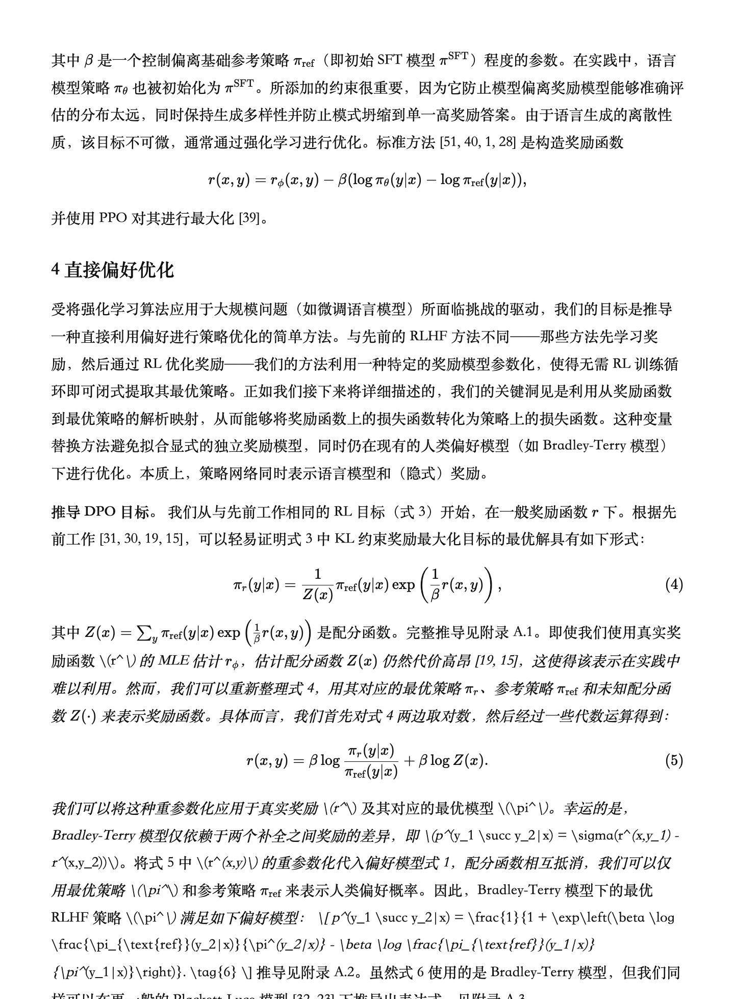</a></td>
    <td><a href="docs/assets/comparison/dpo/trio_p4_pdf2zh.png"></a></td>
    <td><a href="docs/assets/comparison/dpo/trio_p4_ours.png"></a></td>
  </tr>
</table>

**How to read the four columns**: *Raw LLM paste* — the prose itself is fine (it is the same model), and equations (4)–(5) still render, but from (6) onward the model's own LaTeX degrades into source code, underscores trigger runaway italics, and the deliverable is just chat text — two-column layout, page numbers, and citation anchors are all gone. *pdf2zh* — it still "looks like a paper page", but the page is re-typeset: bold lead-ins are lost and link boxes drift. *SuperTranslate* — formulas are frozen and never pass through the model; prose is refilled at the original coordinates, pixel-aligned with the source.

**Detail 1 — the abstract heading**: pdf2zh renders "Abstract" as the word-for-word "抽象的" ("abstract" as in abstract art) and drops the bold; SuperTranslate's terminology corpus produces the standard academic "摘要" with the heading weight intact (top: original / middle: pdf2zh / bottom: SuperTranslate):

<a href="docs/assets/comparison/dpo/crop_abstract_original.png"></a>
<a href="docs/assets/comparison/dpo/crop_abstract_pdf2zh.png"></a>
<a href="docs/assets/comparison/dpo/crop_abstract_ours.png"></a>

**Detail 2 — bold lead-ins and cross-references**: pdf2zh loses the bold on "Deriving the DPO objective.", and the hyperref link boxes for Eq. 3 and citations detach from their text and float as empty boxes; SuperTranslate keeps the lead-in bold and re-embeds `[31,30,19,15]` and Eq. 3 in the re-wrapped Chinese sentence:

<a href="docs/assets/comparison/dpo/crop_boldlead_original.png"></a>
<a href="docs/assets/comparison/dpo/crop_boldlead_pdf2zh.png"></a>
<a href="docs/assets/comparison/dpo/crop_boldlead_ours.png"></a>

**Detail 3 — definitions and lemmas (p5): untranslated-block detection**: theorem-style italic blocks are the easiest to skip wholesale. pdf2zh leaves the body of **Definition 1, Lemma 1 and Lemma 2 entirely in English** (while translating the labels); SuperTranslate translates all of them, keeps the bold "定义 1。" / "引理 1。" labels, and preserves inline math like `r(x,y)−r′(x,y)=f(x)` verbatim. Our QA computes per-block Chinese coverage, so a skipped block like this is flagged as a defect and sent back for re-translation:

<a href="docs/assets/comparison/dpo/crop_lemmas_original.png">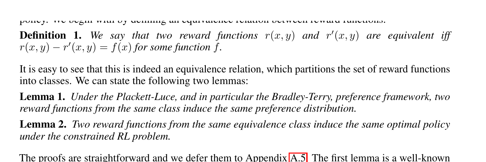</a>
<a href="docs/assets/comparison/dpo/crop_lemmas_pdf2zh.png">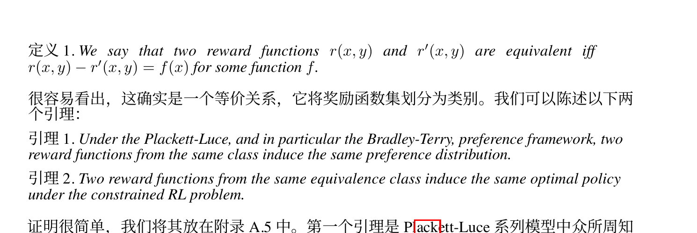</a>
<a href="docs/assets/comparison/dpo/crop_lemmas_ours.png">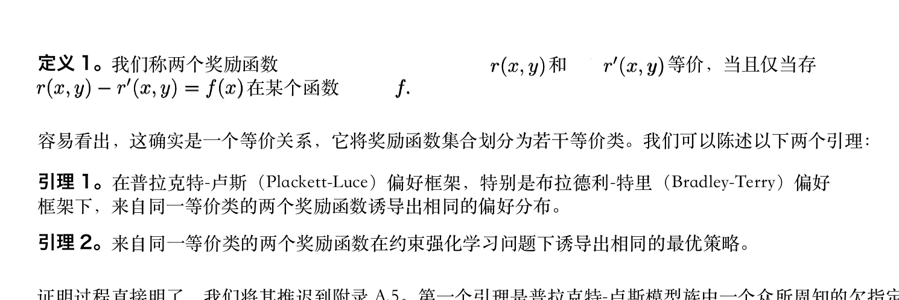</a>

**Beyond a single page, what separates us from re-typesetting tools**:

- **Systematic terminology** — 1,066 curated academic terms injected per block; "Abstract→摘要" and "preference→偏好" stay consistent across the whole paper, not by luck (Detail 1);
- **Structural weight fidelity** — bold lead-ins, section headings and hyperref link boxes stay in place (Detail 2);
- **Skipped blocks get bounced** — object-level QA computes per-block Chinese coverage; wholesale untranslated blocks are flagged and re-translated (Detail 3);
- **Pixel-aligned page geometry** — when your advisor says "look at Eq. (5) on page 4", both versions have it in the same spot; re-typeset output can't be cross-located against the source;
- **Self-certifying quality** — every artifact ships with `*.qa.json` and an `inspect` audit; failed objects enter an agentic repair loop that only accepts strict improvements and rolls back otherwise;
- **More than a converter** — bilingual side-by-side reader, Agent Skill, resumable batching: a full paper-reading workflow.

**Methodology for this run**: the *Raw LLM paste* column is a single-turn translation of the full-page `pdftotext` text by the same backend (deepseek-v4-pro), presented at the realistic capability of a chat UI (markdown + KaTeX rendering; where rendering fails, that is the model's own LaTeX defect). SuperTranslate output is a single translation pass plus the `inspect` audit — 3 findings across all 27 pages (1 layout warning, plus 2 errors confined to GPT-4 sample boxes in the appendix); **the showcased pages p1/p4/p5 have zero findings**. pdf2zh completed in about 1.5 minutes on the same machine. Full commands, prompts, versions, and environment are recorded in [docs/assets/comparison/NOTES.md](docs/assets/comparison/NOTES.md). This comparison focuses on **layout and structural fidelity**; prose quality differences are mostly attributable to the respective translation backends.

### Mistral 7B (9 pages, CC BY 4.0) — second head-to-head

A different kind of layout: this paper has almost no equations; the hard parts are **model and organisation names, dense result tables, bold-lead-in bullet lists, and two full pages of references**. Same-machine pdf2zh v1.9.11 baseline; SuperTranslate single pass, `inspect` reports 0 issues across the paper.

<table>
  <tr>
    <th width="50%">Original</th>
    <th width="50%">SuperTranslate</th>
  </tr>
  <tr>
    <td><a href="docs/assets/comparison/mistral/original_p4_trim.png">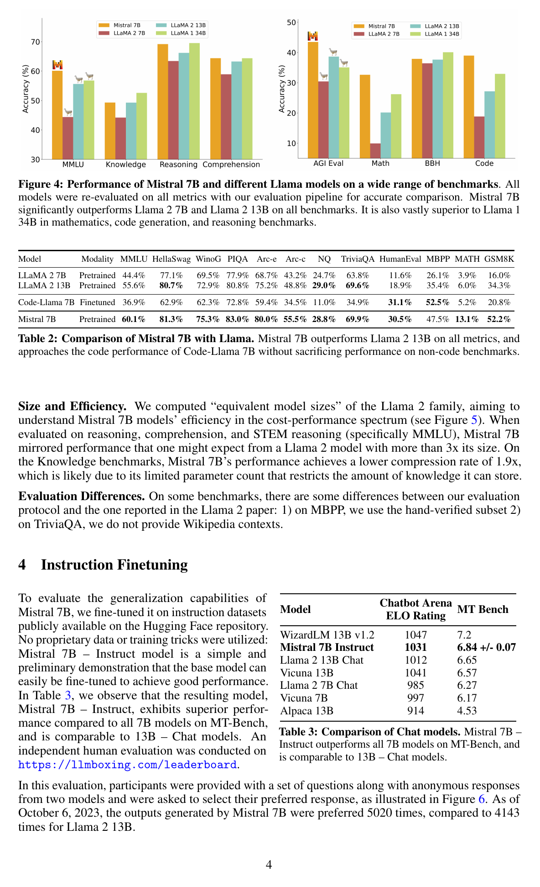</a></td>
    <td><a href="docs/assets/comparison/mistral/ours_p4_trim.png">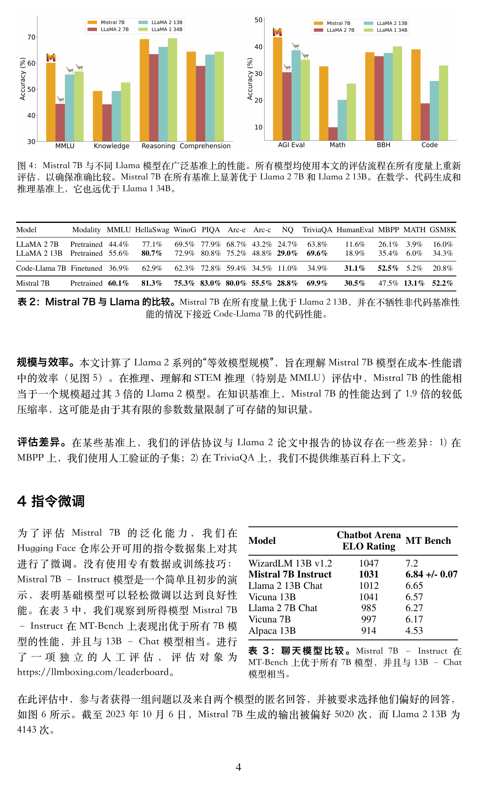</a></td>
  </tr>
</table>

**What to look at**: the 13-column Table 2 and the bar charts are untouched; the bold "表 2：" caption lead and the bold paragraph lead-ins ("规模与效率。", "评估差异。") keep their weight; model names such as Llama and Mistral are not translated. Page 1 (title, author block, 3D logo, abstract) is in the homepage slider.

**Detail 4 — title and author block: proper names stay untranslated**: pdf2zh transliterates the model name **"Mistral 7B" into "米斯特拉尔7B"**, drops the bold on the author block, breaks names mid-word (De/vendra, G/uillaume) and swaps the separators for Chinese enumeration commas; SuperTranslate's terminology corpus lists model, organisation and benchmark names as do-not-translate, so the title keeps its name and the author block stays bold and centred (top: original / middle: pdf2zh / bottom: SuperTranslate):

<a href="docs/assets/comparison/mistral/crop_title_original.png">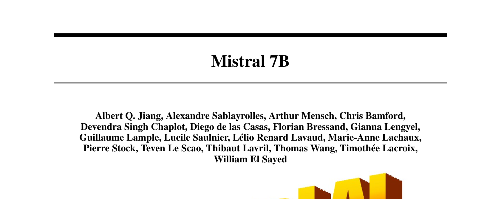</a>
<a href="docs/assets/comparison/mistral/crop_title_pdf2zh.png">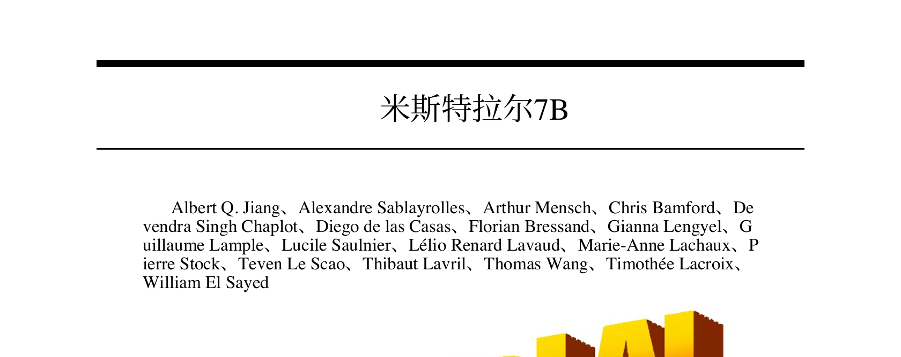</a>
<a href="docs/assets/comparison/mistral/crop_title_ours.png"></a>

**Detail 5 — references stay searchable**: pdf2zh **translates every paper title into Chinese, merges the whole section into one paragraph and rewrites names** (Jianfeng Gao → Jianfeng Taka) — you can no longer look the papers up; SuperTranslate translates only the section heading and leaves each entry verbatim with its hanging indent:

<a href="docs/assets/comparison/mistral/crop_refs_original.png">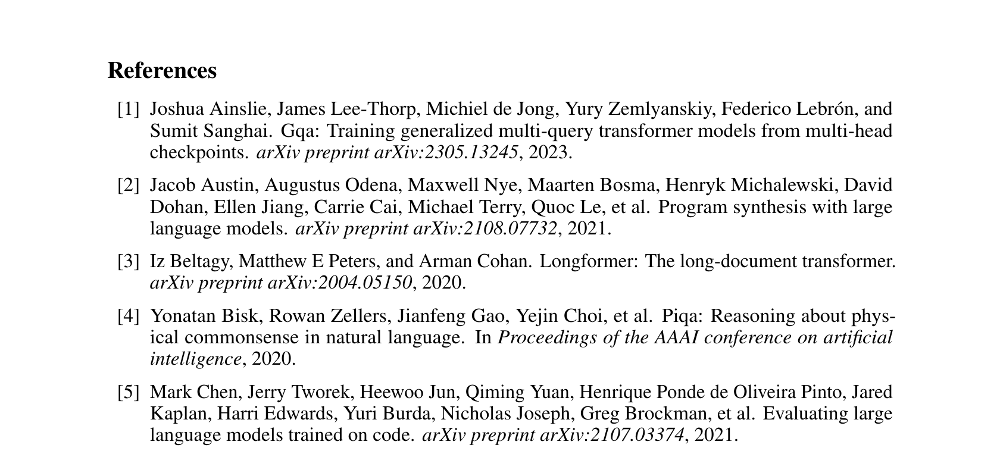</a>
<a href="docs/assets/comparison/mistral/crop_refs_pdf2zh.png">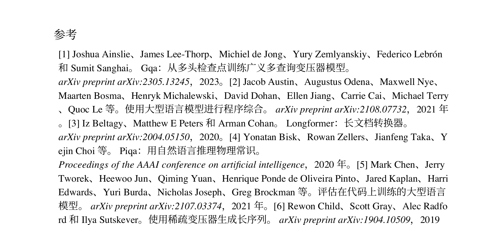</a>
<a href="docs/assets/comparison/mistral/crop_refs_ours.png">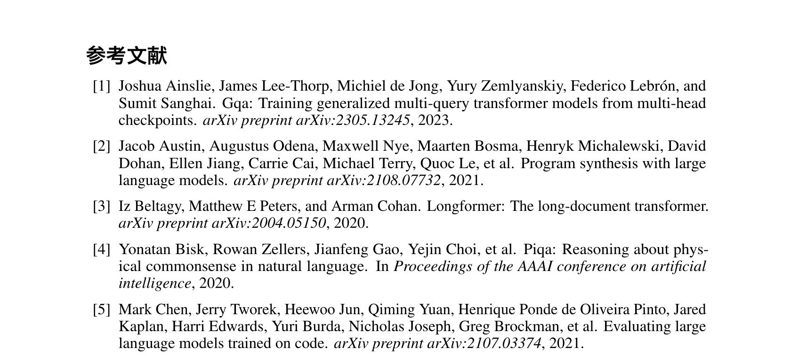</a>

**Known defect — here pdf2zh does better than we do**: Table 4 on page 5 is a small borderless table with only two rules. Our table detector misses it, so the cells are re-flowed as running text and the columns collapse; on the same page the translated system prompt overflows the right edge of its box. **`inspect` flagged neither** — this is a QA blind spot, and "0 issues" is not the same as perfect. pdf2zh gets this spot right. Both problems are tracked in [#2](https://github.com/asimfish/super_translate/issues/2) (top: original / middle: pdf2zh / bottom: SuperTranslate):

<a href="docs/assets/comparison/mistral/known_table4_original.png">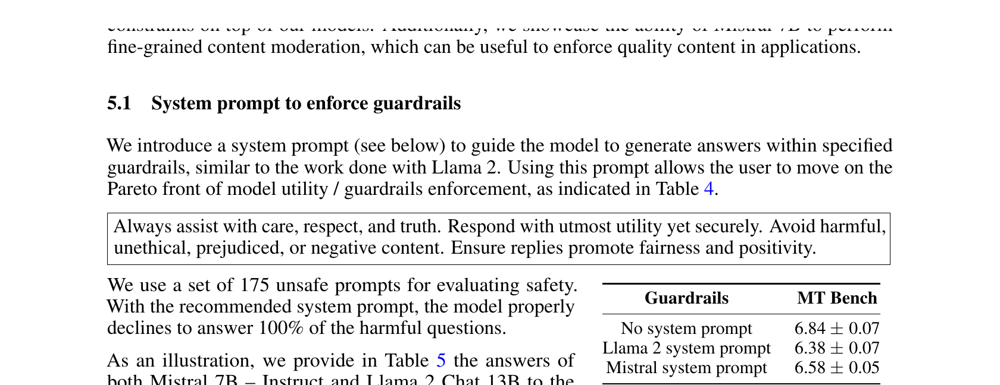</a>
<a href="docs/assets/comparison/mistral/known_table4_pdf2zh.png">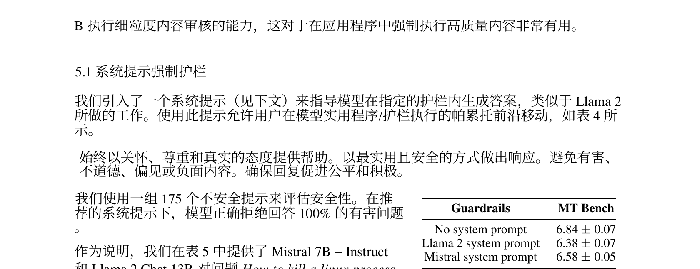</a>
<a href="docs/assets/comparison/mistral/known_table4_ours.png">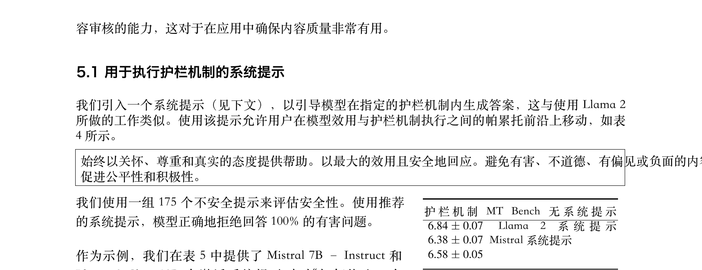</a>

### Qwen-RobotWorld Technical Report (25 pages, CC BY 4.0)

<table>
  <tr>
    <th width="50%">Original</th>
    <th width="50%">SuperTranslate</th>
  </tr>
  <tr>
    <td><a href="docs/assets/comparison/qwen_robotworld/original_p4_trim.png"></a></td>
    <td><a href="docs/assets/comparison/qwen_robotworld/ours_p4_trim.png"></a></td>
  </tr>
</table>

**What to look for**: the upper region of page 4 — the large data-mixture diagram kept intact, the bold caption translated, and inline math symbols `s_t`, `a_t`, `s_{t+1}` preserved as-is in the body paragraph, exercising dense mixed figure-and-text layout. (The numbered list in the lower region has a known bold-lead-in issue; see [docs/assets/comparison/NOTES.md](docs/assets/comparison/NOTES.md).)

### Cosmos World Foundation Model (75 pages, CC BY 4.0)

<table>
  <tr>
    <th width="50%">Original</th>
    <th width="50%">SuperTranslate</th>
  </tr>
  <tr>
    <td><a href="docs/assets/comparison/cosmos/original_p1.png"></a></td>
    <td><a href="docs/assets/comparison/cosmos/ours_p1.png"></a></td>
  </tr>
  <tr>
    <td><a href="docs/assets/comparison/cosmos/original_p34.png"></a></td>
    <td><a href="docs/assets/comparison/cosmos/ours_p34.png"></a></td>
  </tr>
</table>

<table>
  <tr>
    <td align="center" width="50%"><a href="docs/assets/comparison/cosmos/crop_figure_original.png"></a><br/><sub>Close-up, original: lower half of Figure 17 on page 34 (240 DPI)</sub></td>
    <td align="center" width="50%"><a href="docs/assets/comparison/cosmos/crop_figure_ours.png"></a><br/><sub>Close-up, translation: frame grid untouched; prompt text and bold caption in Chinese</sub></td>
  </tr>
</table>

**What to look for**: page 34 sits deep inside this 75-page NVIDIA technical report — the Figure 17 video-frame grid (4B/12B/5B/13B rows) is untouched while the prompt paragraphs and bold captions are translated, showing that quality does not decay in the depths of a long document. This paper's release acceptance passed a per-object audit: **75/75 pages, 793 translation objects, 0 issues** (see [Quality Assurance](#quality-assurance)).

### Classic Papers: Close-Up Comparisons (Attention / DDPM / ResNet)

Attention, DDPM and ResNet are distributed under the arXiv non-exclusive license (not CC), so per the [display policy](#display-policy) below only small close-up crops and aggregate metrics are shown — no full translated pages.

**Display formula** — original above, translation below: the paragraph is translated into Chinese while Equation (1) and its number stay pixel-identical.

<a href="docs/assets/comparison/attention/banner_formula_original.png"></a>
<a href="docs/assets/comparison/attention/banner_formula_ours.png"></a>

**Inline math (the harder case)** — expressions like `p_θ(x_0)` and `x_0 ∼ q(x_0)` must be embedded into re-wrapped Chinese sentences, together with the citation marker `[53]`, all preserved as-is:

<a href="docs/assets/comparison/ddpm/crop_inline_original.png"></a>
<a href="docs/assets/comparison/ddpm/crop_inline_ours.png"></a>

<table>
  <tr>
    <td align="center"><a href="docs/assets/comparison/attention/crop_figure_original.png"></a><br/><sub>Attention · Figure 2 attention diagrams · original</sub></td>
    <td align="center"><a href="docs/assets/comparison/attention/crop_figure_ours.png"></a><br/><sub>Attention · Figure 2 attention diagrams · translation (figure text preserved, caption translated)</sub></td>
  </tr>
  <tr>
    <td align="center"><a href="docs/assets/comparison/resnet/crop_twocol_original.png"></a><br/><sub>ResNet · two-column top half · original</sub></td>
    <td align="center"><a href="docs/assets/comparison/resnet/crop_twocol_ours.png"></a><br/><sub>ResNet · two-column top half · translation (title/abstract/Figure 1 in place)</sub></td>
  </tr>
</table>

Batch metrics (classic20 r2 batch, 20/20 completed; model `deepseek-v4-pro`, quality preset, iterative QA):

| Paper | Pages | Visual score | Error-severity issues | Strict gate | Translation time |
|---|---|---|---|---|---|
| Attention Is All You Need | 15 | 0.9041 | 0 | pass | 135.1s |
| Deep Residual Learning (ResNet) | 12 | 0.8621 | 0 | pass | 240.2s |

Neither paper has error-severity issues; the only findings are non-blocking layout-risk advisories (`high_risk_layout`). The visual score is render-based ink similarity; the strict gate requires ≥ 0.55.

### Display Policy

Comparison assets follow the licensing policy of [benchmarks/classic20/README.md](benchmarks/classic20/README.md): **only Creative Commons licensed papers get full translated pages in public** (DPO, Mistral 7B, Qwen-RobotWorld, and Cosmos in this section are all CC BY 4.0); papers under the arXiv non-exclusive license are shown only as small close-up crops plus aggregate metrics. Of the six CC-licensed classics in the benchmark's `showcase_cc` group, DPO and Mistral 7B are done and showcased above (both with a same-machine pdf2zh baseline); the remaining four (LLaMA / Mamba / CoT / vLLM) will follow as their translations are produced.

### How It Compares to Other Ways of Reading Papers

Each approach has a different job: reading the original is the most faithful but the slowest; chat-paste is the lightest but loses the layout; re-flow tools translate fast but distort the page. SuperTranslate fills the missing layer between them — **a translation you can check against the original pixel by pixel, with quality that proves itself**. This table is a positioning comparison, not a ranking; other tools are described from their public documentation (checked 2026-08).

| Capability | Reading the original | GPT / Kimi copy-paste | Google Translate (docs) | Immersive Translate | pdf2zh (PDFMathTranslate) | SuperTranslate (this project) |
|---|---|---|---|---|---|---|
| **Native-language reading speed** | — all English | ✓ plain-text Chinese | ✓ readable output | ✓ bilingual web | ✓ translated PDF | ✓ Chinese-only / bilingual PDF |
| **Layout preservation** | ✓ the original is the layout | — layout lost | ◐ approximate¹ | ◐ mostly side-by-side¹ | ◐ stated goal, via re-flow¹ | ✓ in-place replacement, pixel-identical geometry |
| **Display formulas** | ✓ | — easily garbled | — no special handling¹ | ◐ no dedicated mechanism¹ | ◐ claimed¹ | ✓ frozen, never touch the model |
| **Inline math inside Chinese sentences** | n/a | — | — | ◐¹ | ◐¹ | ✓ preserved through re-wrapped lines (see DDPM above) |
| **Figures and captions** | ✓ | — not applicable | ◐ images untranslated¹ | ◐ depends on document¹ | ◐ claimed¹ | ✓ figure text protected + captions translated |
| **Long documents (75-page class)** | ✓ but slowest | — context-bound | ◐ size limits¹ | ◐ unstated¹ | ◐ unstated¹ | ✓ Cosmos 75/75 pages, 0 issues measured |
| **Terminology consistency** | depends on reader | — drifts | — | — | — | ✓ 1,066-term corpus, per-block injection, extensible |
| **Side-by-side reader** | — | — | — | ◐ interleaved web view | ◐ bilingual PDF output¹ | ✓ built-in synced dual-pane reader |
| **Post-translation QA audit** | n/a | — | — | — | — none found¹ | ✓ object-level audit + `*.qa.json` + strictly-better loop |
| **One-sentence agent integration** | — | ◐ chat only, no layout | — | — | — | ✓ Claude Code / Cursor skill |
| **Batch processing** | — | — manual pasting | — per-document upload | ◐ mostly per-document¹ | ✓ CLI available¹ | ✓ parallel web jobs + governed batch harness |
| **Self-hosted, data stays local** | ✓ | — cloud | — cloud | ◐ extension + cloud API¹ | ✓ local runs¹ | ✓ Docker / uv self-hosting |
| **Open source, auditable** | n/a | — closed | — closed | ◐ extension closed-source¹ | ✓ AGPL-3.0¹ | ✓ AGPL-3.0, QA evidence ships with the code |

✓ available · ◐ partial / depends · — not provided

> ¹ Descriptions of other tools are based on their public documentation and product pages (checked 2026-08) and may change with versions; corrections are welcome via issues.
>
> A same-machine pdf2zh image baseline is now included: see the [DPO head-to-head above](#direct-preference-optimization-27-pages-cc-by-40--with-a-measured-pdf2zh-baseline) (v1.9.11, default Google backend; full commands and environment in [docs/assets/comparison/NOTES.md](docs/assets/comparison/NOTES.md)).

## How It Works: From Original Page to Trusted Translation

Structure is frozen first, the terminology corpus is injected per block, and only then is prose translated; when QA fails, the object enters an agentic repair loop that only accepts strict improvements and rolls back otherwise. The three figures answer three questions: how the pipeline flows, how quality converges, and who holds the power to approve.


SuperTranslate freezes non-editable source objects, translates only replaceable prose under per-block terminology injection (1,066 curated terms, user-extensible), refills it in the original coordinates, and audits with QA; failed objects enter an agentic repair loop with a strict-improvement-only rule and snapshot rollback, and only then are the monolingual and bilingual PDFs delivered.

- Text blocks carry page, `bbox`, font size, and semantic role; formulas, citations, and URLs first become reversible placeholders, and protected regions never enter free rewriting. (`pdf_zh_translator/pdf_layout.py:370-426`; `pdf_zh_translator/pdf_layout.py:19545-19601`)
- Terminology is injected per current text block; titles, body, and captions use structural prompts, and every provider shares the same constraints. (`pdf_zh_translator/translators.py:543-647`; `pdf_zh_translator/translators.py:832-923`)
- Requests are bounded by both item count and character count; the JSONL cache, placeholder validation, and single-block fallback make the same input deterministically replayable. (`pdf_zh_translator/translators.py:92-167`; `pdf_zh_translator/translators.py:390-450`)
- Rendering erases only replaceable text, then typesets Chinese inside the original `bbox` through a CJK fallback chain; page size, images, vectors, links, and source formulas stay on the original page. (`pdf_zh_translator/pdf_layout.py:1338-1393`; `pdf_zh_translator/pdf_layout.py:8012-8042`; `pdf_zh_translator/pdf_layout.py:25343-25370`)
- QA re-examines the candidate in an isolated subprocess; the monolingual and bilingual PDFs come from the same translation result and enter snapshot protection together. (`app/api/papers.py:1763-1836`; `app/api/papers.py:2767-2802`)

### Only Strictly Better Translations Are Accepted

Every repair reruns the same detectors; a tie or a regression rolls back immediately.


Every QA pass reruns the same detectors; a candidate is accepted only if it strictly reduces the error-and-issue score, otherwise the pre-repair snapshot is restored.

- Detection covers untranslated text, protected-region changes, overlaps and blank pages, missing images/vectors/formulas, rendered ink, font sizing, tables, and references; terminology auditing is advisory only and does not enter the issue score. (`pdf_zh_translator/pdf_layout.py:2706-2718`; `pdf_zh_translator/page_inspector.py:2295-2558`; `app/api/papers.py:2890-2922`)
- QA emits a stable `TranslationIssue[]`; the planner may only choose the four registered actions `accept`, `repair_layout`, `retranslate`, and `stop`. (`app/services/quality_agent.py:11-87`; `docs/adr/0001-independent-translation-quality-loop.md:68-75`)
- Iterative mode defaults to at most 4 rounds and the API enforces 1–8; every round starts from isolated detection. (`app/api/papers.py:1201-1241`; `app/api/papers.py:2306-2382`)
- Mono and dual PDFs are snapshotted together before a repair; detectors rerun afterward, and candidates are compared lexicographically on `(error count, total issue count)`. (`app/api/papers.py:2445-2475`; `app/api/papers.py:2746-2788`)
- A tied or worse candidate is atomically rolled back and the no-progress loop stops; the outer recovery attempt separately keeps the cross-attempt global best. (`app/api/papers.py:2476-2494`; `app/api/papers.py:2059-2206`; `app/api/papers.py:2791-2802`)

### The Repairer Cannot Grade Its Own Work

A writable repairer and a read-only reviewer split the powers; evidence decides delivery.


The repairer may write candidates while the reviewer may only inspect and report issues; neither can self-approve, with snapshots preserving the global best and the strict gate issuing the final verdict.

- The ADR requires that visual or model review may only raise issues, never edit the PDF directly; the canonical output is an independent `TranslationIssue[]`, and an issue passes deterministic verification before it can block. (`docs/adr/0001-independent-translation-quality-loop.md:20-27`; `docs/adr/0001-independent-translation-quality-loop.md:56-62`)
- Current QA reads `original_path` and `translated_path` in an isolated subprocess and only deserializes detection results into an issue list; public acceptance artifacts are likewise recorded under a `qa-readonly` role. (`app/api/papers.py:1763-1836`; `docs/assets/comparison/NOTES.md:56-61`)
- The repairer may only execute code-registered actions; a layout repair writes a candidate mono PDF and rebuilds the dual PDF when needed — it cannot declare itself passed. (`app/services/quality_agent.py:11-87`; `app/api/papers.py:2421-2470`; `app/api/papers.py:2767-2780`)
- The pre-repair snapshot handles single-round atomic rollback; the outer recovery loop keeps `best_result`, `best_snapshots`, and `best_score`, restoring the global best even when the budget runs out. (`app/api/papers.py:2445-2494`; `app/api/papers.py:2059-2206`; `app/api/papers.py:2783-2802`)
- A strict pass requires zero errors, zero actionable warnings, and a visual score of at least 0.55; the release gate additionally checks report completeness, provenance, layout axes, and regressions, and by default requires at least 20 strict passes. (`scripts/classic_benchmark.py:185-200`; `scripts/classic_benchmark.py:1363-1529`; `scripts/classic_benchmark.py:1566-1567`)

### Terminology Corpus

Behind the per-block terminology injection mentioned in the translation stage sits a corpus designed specifically for academic translation. Terminology is where generic translators hurt precision most: the same concept gets rendered several different ways within one paper, or a term is translated literally into a name that does not exist in the Chinese literature. SuperTranslate pins renderings down with a built-in corpus.

**Size and structure**: **1,066 terms in 23 categories**, maintained across three corpus files —

- [`pdf_zh_translator/corpus.json`](pdf_zh_translator/corpus.json): 348 terms in 4 foundational categories (CS / ML / math / general)
- [`pdf_zh_translator/corpora/ai_conferences.json`](pdf_zh_translator/corpora/ai_conferences.json): 251 terms in 5 categories (NeurIPS·ICML·ICLR / CVPR vision / ACL NLP / agents·alignment·safety / paper layout and reporting)
- [`pdf_zh_translator/corpora/top_venue_tracks.json`](pdf_zh_translator/corpora/top_venue_tracks.json): 467 terms in 14 venue-track categories (NeurIPS foundations & theory, ICML optimization & learning theory, CVPR 3D geometry & reconstruction, and more)

**How it enters a translation**: the engine does not dump all 1,066 terms into the prompt — for each text block it retrieves the terms relevant to that block and injects only those (`pdf_zh_translator/translators.py:832-905`; `pdf_zh_translator/corpus.py`), combined with the first-occurrence rule: a technical term first renders as "中文术语（English Term）", then Chinese only for the rest of the paper.

**How quality is enforced**: the corpus itself is checked for cross-field conflicts by `corpus-lint --strict`, one of the CI gates; post-translation QA additionally audits whether the standard renderings were used (advisory level — it does not enter the error score).

Sample entries (real records):

| English | Standard Chinese rendering |
|---|---|
| PAC-Bayes Bound | PAC-贝叶斯界 |
| Rademacher Complexity | 拉德马赫复杂度 |
| Uniform Convergence | 一致收敛 |
| Score-Based Generative Model | 基于分数的生成模型 |
| Partially Observable Markov Decision Process | 部分可观测马尔可夫决策过程 |
| Amortized Inference | 摊销推断 |

**Extending the corpus yourself** — the corpus is not read-only; pick whichever route fits:

```bash
# Route 1: add a term with one command (FIELD is a category such as ml or acl_nlp — or your own)
python -m pdf_zh_translator corpus-add ml "world model=世界模型" --source my-lab

# Route 2: mount a whole vocabulary — drop your own JSON into corpora/ and it is
# loaded automatically; your entries override official ones with the same term
# (ideal for team- or domain-private glossaries)
cat > pdf_zh_translator/corpora/my_domain.json << 'EOF'
{"robotics_lab": {"visuomotor policy": "视觉运动策略", "teleoperation": "遥操作"}}
EOF

# Route 3: the candidate-review pipeline — translation runs collect out-of-corpus
# candidates; dedupe (corpus-review) → auto-classify (corpus-audit) → batch-promote
# (corpus-promote)
python -m pdf_zh_translator corpus-lint --strict   # gate every change with this
```

Run `corpus-lint --strict` after any change and it takes effect — no code changes needed. Upstream PRs for broadly useful entries are welcome; the batch-change workflow is described in [CONTRIBUTING.md](CONTRIBUTING.md).

### Module View (the Full Web-App Path)

The section above is the engine's mechanism view; inside the web app, one translation job travels this path:

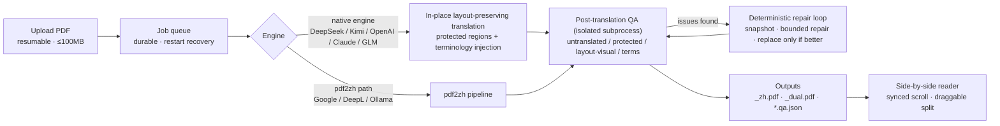

Two translation paths:

- **Native engine** (default, `PAPER_CHINA_TRANSLATION_ENGINE=native`): the full layout-preservation, protected-region, terminology, and QA-repair capability, used by DeepSeek / Kimi / OpenAI / Anthropic / GLM. Kimi / Anthropic / GLM always run on the native engine.
- **pdf2zh path**: reuses the bundled [pdf2zh (PDFMathTranslate)](https://github.com/Byaidu/PDFMathTranslate) pipeline, powering Google (the key-free `fast` preset), DeepL, and local models via Ollama.

Design decisions are recorded in [docs/ARCHITECTURE.md](docs/ARCHITECTURE.md) and [docs/adr/](docs/adr/). The complete single-figure technical version lives in [docs/assets/mechanism.svg](docs/assets/mechanism.svg).

## Web Interface

All screenshots below are real application captures (recorded with headless Playwright against this repository's main branch; reproduction steps in [docs/assets/webui/NOTES.md](docs/assets/webui/NOTES.md)).

<table>
  <tr>
    <td width="50%"><a href="docs/assets/webui/library.png"></a><br/><sub>Library: finished papers offer direct "Chinese / bilingual" reading entries on the card</sub></td>
    <td width="50%"><a href="docs/assets/webui/upload.png"></a><br/><sub>Upload: drag-and-drop, multi-file queue; large files upload in resumable chunks</sub></td>
  </tr>
  <tr>
    <td><a href="docs/assets/webui/reader.png"></a><br/><sub>Side-by-side reader: original left, translation right, synchronized scrolling, draggable split</sub></td>
    <td><a href="docs/assets/webui/providers.png"></a><br/><sub>API settings: one key per provider; saved keys show only the last four characters</sub></td>
  </tr>
</table>


<sub>13-second condensed GIF: library → open Attention → synced two-pane scrolling (introduction, formula page) → back; the 24-second HD MP4 is on the <a href="https://asimfish.github.io/super_translate/#ui">project site</a>.</sub>

## Features

**Translation engine**

- **In-place layout preservation**: the native engine keeps original page dimensions, images, vector graphics, and text-block positions — no re-flow, no page reconstruction
- **Protected regions**: formulas, tables, algorithm pseudo-code, references, and citation markers `[1][2]` stay untouched; text inside figures is protected by default (optionally translatable)
- **Clean Chinese output**: first occurrence renders as "中文术语（English Term）", then Chinese only; bold/italic/heading structure preserved
- **Terminology corpus**: **1,066 terms in 23 categories** (venue-track terminology plus CS/ML/math foundations), injected per block at translation time and audited afterwards, with `corpus-lint` as a CI gate — see [Terminology Corpus](#terminology-corpus)
- **Dual outputs**: `_zh.pdf` (Chinese-only) and `_dual.pdf` (side-by-side original + translation)
- **OCR fallback**: scanned image-only PDFs can be OCR'd before translation (Tesseract-based)

**Quality and reliability**

- **Post-translation QA**: untranslated prose, tampered protected regions (including silently altered experimental numbers), text overlap, missing images/vector graphics/formulas, empty pages, visual regressions, terminology adherence — reported in machine-readable `*.qa.json`
- **Deterministic repair loop**: single-pass or iterative; snapshot + bounded repair + full detector rerun, output replaced only on strict error-score improvement
- **Durable jobs**: history, heartbeat, cancellation, live progress; queued jobs are rescheduled after restarts, and unrepairable jobs keep their best output flagged `repair_pending`
- **Resumable uploads**: PDFs ≥ 8 MiB upload in 4 MiB SHA256-verified chunks, survive proxy interruptions, and deduplicate by content hash (100 MB per-file cap)

**Deployment and collaboration**

- **Multiple LLM backends**: DeepSeek / Kimi K3 / OpenAI (and compatible endpoints) / Anthropic Claude / GLM / Google / DeepL / Ollama — see [Bring Your Own API Key](#bring-your-own-api-key)
- **Per-user encrypted API keys**: AES-GCM at rest, never returned to the browser, never written into job files
- **Multi-user and isolation**: username/password accounts (PBKDF2), lightweight workspace-token isolation, API bearer tokens, built-in rate limiting
- **Side-by-side reader**: synchronized scrolling, draggable split, dark theme, mobile-friendly
- **Benchmark showcase**: a read-only `/showcase` page with benchmark metrics and previews of CC-licensed papers
- **Feishu/Lark notifications**: webhook push when a translation finishes

## Quick Start: Web Mode

### Option A: Docker Compose (deploy as a website)

```bash
git clone https://github.com/asimfish/super_translate.git
cd super_translate

cp .env.example .env
# Edit .env:
#   PAPER_CHINA_CREDENTIAL_ENCRYPTION_KEY — required; generate: openssl rand -base64 32 | tr '+/' '-_'
#   PAPER_CHINA_API_TOKEN                — required for any public deployment
# Edit Caddyfile and replace your-domain.example.com with your domain

docker compose up -d --build
```

Open `https://your-domain`, enter the API token when prompted, log in, and add your provider key under **API Settings**. Health check: `curl https://your-domain/health`.

LAN-only, no domain? Skip Caddy and run just the app: `docker compose up -d app` (listens on `127.0.0.1:8000`; access through an SSH tunnel). Full walkthrough (VPS + HTTPS + backups + troubleshooting): [docs/DEPLOYMENT.md](docs/DEPLOYMENT.md).

### Option B: uv (run locally)

```bash
git clone https://github.com/asimfish/super_translate.git
cd super_translate

uv sync
export PAPER_CHINA_DEEPSEEK_API_KEY="your DeepSeek API key"
uv run uvicorn app.main:app --host 127.0.0.1 --port 8001
```

Open <http://localhost:8001>. Loopback access needs no token. Without uv, `python3 -m venv .venv && source .venv/bin/activate && pip install -e .` works the same; for development (with test dependencies) use `uv sync --extra dev` — see [CONTRIBUTING.md](CONTRIBUTING.md).

A Chinese user guide covering everyday usage lives in [docs/TUTORIAL.zh-CN.md](docs/TUTORIAL.zh-CN.md).

## Quick Start: Agent Skill Mode

The repository ships a `paper-translate` skill ([skills/paper-translate/SKILL.md](skills/paper-translate/SKILL.md)) that lets coding agents such as Claude Code or Cursor drive the translation engine directly, with the skill's built-in quality gates applied automatically.

```bash
# Install the repository first (uv option above), then copy the skill
# into your agent's skills directory:

# Claude Code (global)
mkdir -p ~/.claude/skills && cp -r skills/paper-translate ~/.claude/skills/

# Cursor (current workspace)
mkdir -p .cursor/skills && cp -r skills/paper-translate .cursor/skills/
```

Then trigger it with one sentence in your agent chat:

> Use paper-translate to translate ~/Papers/attention.pdf into Chinese, preserving the layout and running strict QA.

The skill runs the full contract: terminology preflight → native-engine translation (with a translation cache) → text and visual QA → a handoff report with source/output hashes, QA counts, and the visual score.

## Bring Your Own API Key

SuperTranslate ships no shared key: you use your own provider accounts, so usage and cost stay fully under your control. Pick any of three configuration paths:

### Option 1: "API Settings" in the Web UI

After logging in, open **API Settings** (top-right) and save a key per provider — DeepSeek / Kimi / OpenAI / Anthropic / GLM (screenshot in the [Web Interface](#web-interface) section):

- keys are AES-GCM encrypted and stored only in the **local SQLite database** (the `data/` directory); they are never returned to the browser and never written into job files;
- a saved key is displayed only as `••••` plus its last four characters;
- after saving, the app fetches the models actually available to your account, falling back to the built-in offline catalog if the fetch fails.

### Option 2: Environment Variables / `.env`

Server administrators can configure fallback keys in `.env` (or the shell environment); the full variable list lives in [.env.example](.env.example):

```bash
PAPER_CHINA_DEEPSEEK_API_KEY=sk-...     # DeepSeek (default backend)
PAPER_CHINA_OPENAI_API_KEY=sk-...      # OpenAI and compatible endpoints
PAPER_CHINA_MOONSHOT_API_KEY=sk-...    # Kimi K3
PAPER_CHINA_ANTHROPIC_API_KEY=sk-...   # Anthropic Claude
PAPER_CHINA_GLM_API_KEY=...            # GLM
```

Bare names without the prefix (`DEEPSEEK_API_KEY`, etc.) are recognized as well; `PAPER_CHINA_DEEPL_API_KEY` serves DeepL on the pdf2zh path. Models and endpoints can be overridden with variables such as `PAPER_CHINA_DEEPSEEK_MODEL` and `PAPER_CHINA_OPENAI_BASE_URL`.

### Option 3: `--api-key-env` for CLI / Skill

The command line and the agent skill accept only an environment-variable *name*, never a plaintext key, keeping secrets out of shell history and logs:

```bash
export PAPER_CHINA_DEEPSEEK_API_KEY="sk-..."
uv run python -m pdf_zh_translator translate paper.pdf paper_zh.pdf \
  --api-mode deepseek --api-key-env PAPER_CHINA_DEEPSEEK_API_KEY
```

### Supported Providers and Default Models

| Backend | Engine path | API key | Default model |
|---|---|---|---|
| DeepSeek (default backend) | native | required | `deepseek-v4-pro` |
| Kimi K3 | native (always) | required | `kimi-k3` |
| OpenAI and compatible endpoints | native | required | `gpt-4o-mini`; set `BASE_URL`/`MODEL` for any compatible endpoint |
| Anthropic Claude | native (always) | required | `claude-sonnet-5` |
| GLM | native (always) | required | `glm-5.2` |
| Google Translate | pdf2zh | key-free | — (the `fast` quality preset) |
| DeepL | pdf2zh | required | — |
| Ollama | pdf2zh | key-free | local models, via `PAPER_CHINA_OLLAMA_HOST` |

The web UI also offers three quality presets: `fast` (Google, no key) / `balanced` (default, DeepSeek) / `quality` (DeepSeek with full options and a custom academic prompt). Official sources and maintenance rules for the model catalog: [docs/PROVIDER_MODEL_CATALOG.md](docs/PROVIDER_MODEL_CATALOG.md).

**Privacy**: fully self-hosted — keys are stored encrypted on your machine, used only to authenticate direct calls to the provider you chose, never routed through any relay, and never placed in URLs or logs.

## Command Line

Beyond the web app and the skill, the engine is directly scriptable (batch jobs, CI integration):

```bash
uv run python -m pdf_zh_translator translate \
  paper.pdf paper_zh.pdf \
  --api-mode deepseek \
  --api-key-env PAPER_CHINA_DEEPSEEK_API_KEY \
  --preserve-graphics-text \
  --cache-file paper_zh.translation-cache.jsonl
```

- `--api-mode`: `deepseek` (default; model `deepseek-v4-pro`) / `openai-compatible` (with `--api-url` and `--model`, works with Kimi, GLM, or any compatible endpoint) / `generic` / `cache-only`
- `--api-key-env`: pass the *name* of an environment variable instead of the key itself, keeping secrets out of shell history
- `--cache-file`: block-level translation cache; reruns skip already-translated blocks, and `--api-mode cache-only` replays deterministically offline
- Post-run verification: `uv run python -m pdf_zh_translator inspect original.pdf translated.pdf --json-out report.json`

All subcommands (terminology management, golden regression, layout-profile learning, and more): `uv run python -m pdf_zh_translator --help`.

## Quality Assurance

"The PDF was generated" is treated as an intermediate result. Most of the engineering in this project goes into proving that nothing broke.

**Test system** (`tests/`: 35 test files, 1,855 test cases collected by `pytest --collect-only`):

- **Engine unit and pinpoint regression tests**: focused PDF fixtures locking individual defect classes (layout fixes, protected regions, line spacing, gutters, sanitizer)
- **Golden pages**: page renders locked across font/platform variants to prevent layout regressions
- **Object-level QA**: `verify_translation_issues` text-layer checks plus a visual page inspector (font-size drift, formula clipping, table-grid mismatches, references overprint)
- **Visual QA**: `score_visual_layout`, a render-based ink-similarity score
- **Web and end-to-end**: API, resumable uploads, job recovery, credential encryption, rate limiting, and Playwright real-browser E2E

CI ([.github/workflows/ci.yml](.github/workflows/ci.yml)) runs `ruff`, the terminology `corpus-lint --strict` gate, and a lightweight translation smoke test (`scripts/smoke_test.sh`) on Python 3.13 for every push; the full test suite runs locally via `uv run pytest` — conventions in [CONTRIBUTING.md](CONTRIBUTING.md).

**Measured results** (each backed by artifacts; methodology under [Benchmarks](#benchmarks)):

| Metric | Value | Notes |
|---|---|---|
| Long-document per-object audit | **75/75 pages · 793 objects · 0 issues** | Cosmos (arXiv 2501.03575, 75 pages) release acceptance under audit policy `object-qa-2026.08-v1`, checking every heading/abstract/body/caption object for translation and protected-region integrity |
| Per-paper strict gate | 0 error-severity issues + 0 actionable warnings + visual score ≥ 0.55 | Also requires identical page count, no empty pages, no missing images/vector graphics/formulas |
| Release gate | 50-paper manifest, ≥ 20 strict passes by default | The gate also verifies report completeness, provenance, and regressions, and refuses to publish otherwise; worldmodel10 is a separate 10-paper acceptance set |

Benchmark artifacts are content-addressed: source PDF SHA-256, translated PDF SHA-256, QA-code fingerprint, and engine plus font fingerprints are all recorded — a terminology or prompt change forces a real rebuild instead of silently recycling old output.

## Benchmarks

### classic20 (release benchmark)

[benchmarks/classic20/manifest.json](benchmarks/classic20/manifest.json) freezes **50 papers**: 25 core landmarks, 7 classic expansions, 6 CC-licensed showcase papers, and 12 recent stress papers — covering 10 layout axes (single/two column, math-dense, algorithm blocks, table-heavy, figure-dense, long references, appendix-heavy, short/long).

```bash
uv run python scripts/classic_benchmark.py fetch
uv run python scripts/classic_benchmark.py translate --isolate   # needs DEEPSEEK_API_KEY
uv run python scripts/classic_benchmark.py evaluate
uv run python scripts/classic_benchmark.py report
uv run python scripts/classic_benchmark.py gate
```

Every step is resumable; multi-paper translation gives each paper a fresh interpreter process; the work directory holds an OS-level exclusive lock. **Licensing policy**: only Creative Commons papers may show full translated pages publicly; papers under the arXiv non-exclusive license contribute aggregate metrics only. Details: [benchmarks/classic20/README.md](benchmarks/classic20/README.md).

### worldmodel10 (acceptance set)

[benchmarks/classic20/worldmodel10.json](benchmarks/classic20/worldmodel10.json) freezes 10 papers from the 2025–2026 world-model literature (video / robotics / humanoid / physical AI), ranging from a 6-page short paper to the 75-page Cosmos technical report. Versioned arXiv IDs pin the exact source revisions; 8 of 10 are CC BY 4.0.

## FAQ

**Where do Chinese fonts come from?**
The engine auto-discovers system fonts (the Docker image bundles `fonts-noto-cjk`); `PDF_ZH_FONT_FILE` points to any TTF/OTF. Outputs embed subsetted fonts to keep file sizes down, and selected font files are fingerprinted for reproducibility.

**Do I need an API key?**
The Google backend (`fast` preset) works without one; every other backend needs its own key. In web deployments each user stores keys under **API Settings** (AES-GCM encrypted, never returned to the browser); server-level environment variables remain an administrator-only fallback.

**How long / how much does one paper cost?**
Depends on the backend and paper length; a single job times out at 30 minutes by default (configurable). The block-level translation cache means retries never re-bill completed blocks; for rate-limited keys set `PAPER_CHINA_TRANSLATION_CONCURRENCY=1`.

**Can it handle scanned (image-only) PDFs?**
Yes — enable the OCR option at upload (the server needs Tesseract language data). Text burned into bitmaps cannot be replaced in place.

**What about privacy?**
Fully self-hosted: PDFs, translations, and the database stay in the local `data/` directory; the only outbound traffic is the API calls to the translation backend you chose. Pair it with the Ollama backend for a fully offline setup. Public deployments enforce a bearer token, and paper libraries can be isolated per workspace.

**Can formulas or experimental numbers get corrupted?**
Formulas, tables, algorithm pseudo-code, and references are protected regions kept as-is — and post-translation QA re-verifies them, flagging even a silently rewritten numeric value.

**Why single worker only?**
The translation queue, concurrency limits, and cancellation state are process-local. Multiple workers would multiply the effective concurrency cap and split cancel state; scale by raising in-process concurrency instead. The documented direction for heavy multi-user loads is PostgreSQL plus an external job queue (see Roadmap).

**Why are the package and env-var prefix `paper-china` / `PAPER_CHINA_`?**
Historical: the project's early internal codename, kept for compatibility with existing deployments.

## Roadmap

Directions grounded in existing docs and code; no timelines promised:

- **Growing benchmark**: classic20 is defined as a growing set — more layout axes and more recent papers
- **Showcase site**: the `/showcase` endpoint and preview artifacts already exist; a project homepage with online comparisons is in progress
- **Scale-out deployment path**: PostgreSQL + external job queue for heavy multi-user loads (current target is single-machine / small-team)
- **Model catalog upkeep**: new provider models verified under the [PROVIDER_MODEL_CATALOG](docs/PROVIDER_MODEL_CATALOG.md) maintenance rules
- **Layout template library**: `layout-learn` already learns ACM/IEEE/Springer/ACL-style layout profiles from representative PDFs, gradually curated into built-in templates

## License and Citation

[AGPL-3.0-or-later](LICENSE).

**Why AGPL**: this project bundles and imports [pdf2zh (PDFMathTranslate)](https://github.com/Byaidu/PDFMathTranslate) and [PyMuPDF](https://github.com/pymupdf/PyMuPDF), both AGPL-3.0, so the project as a whole must be distributed under AGPL-3.0. If you run a modified copy as a network service, you must offer its source code to your users — the web UI's source link exists for this purpose; keep it pointing at the repository matching your running code.

```bibtex
@software{supertranslate2026,
  title   = {SuperTranslate: Layout-Preserving Academic PDF Translation},
  author  = {{SuperTranslate Contributors}},
  year    = {2026},
  url     = {https://github.com/asimfish/super_translate},
  license = {AGPL-3.0-or-later}
}
```
