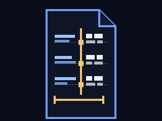
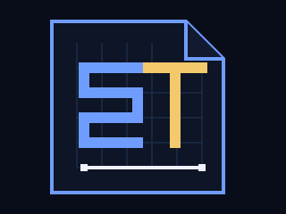
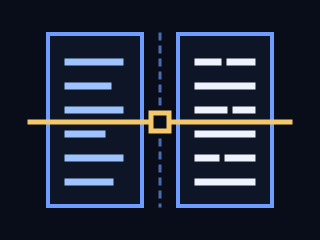

# SuperTranslate Logo 设计说明

## 结论

主方案采用方向 A「配准页 Registered Page」。它把项目最难被竞品复制的能力直接画出来：左侧是英文行纹理，右侧是中文块纹理，但三组基线和页框完全配准；中间金色轨道及三个方形节点代表确定性 QA 逐项审计；页底金色卡尺线代表页面几何被锁定。整个符号没有翻译箭头，表达的是「内容发生变化，版式坐标没有变化」。

横版字标使用纯 SVG 路径构成的定制几何大写字形，`SUPER` 用工程蓝，`TRANSLATE` 用墨白或深墨色。没有外部字体、滤镜或渐变，因此跨系统渲染一致。

## 三个概念方向

### A. 配准页 Registered Page



一张带折角的论文页被金色审计轨分成两半，EN 行纹理与 ZH 方块纹理逐行落在同一网格上，页底卡尺锁住宽度。它同时覆盖保版式、英译中和确定性 QA 三个卖点，64 px 下仍能识别，因此选为主方案。

### B. 像素 ST Pixel ST Folio



将 `S` 与 `T` 组合进像素网格和文档折角，工程感最强，也适合开发者工具头像；但不看项目名时更像通用开发工具缩写，保版式语义弱于方向 A。

### C. 同步双栏 Synchronized Columns



两列等高内容由一条金色扫描线同步校验，最直接对应双栏对照阅读和逐像素检查；但轮廓较通用，缩成头像后与常见分栏、比较类产品不易区分。

## 主方案构成

- 文档外框与折角：学术论文及 PDF，不使用圆角模板化容器。
- 左侧短横线：英文的行级纹理。
- 右侧方块组：中文更紧凑的方块字纹理。
- 三条水平配准线：翻译前后对象仍处于相同基线与坐标。
- 金色竖轨与方形节点：对象级 QA 检查点和可复核审计链。
- 金色底部卡尺：页面宽度、边界和整体几何保持不变。
- 几何字标：全部由基础路径绘制，不依赖本地字体。

## 文件与版本

- `logo.svg`：横版深底用组合标，背景透明，建议放在 `#090D1A` 或 `#0C1224` 上。
- `logo-light.svg`：横版浅底用组合标，背景透明，建议放在白色或 `#F7F9FE` 上。
- `logo-icon.svg`：自带 `#090D1A` 方形底的独立 icon，适合头像和应用图标。
- `logo-icon-light.svg`：自带 `#F7F9FE` 方形底的浅色独立 icon。
- `favicon.svg`：删除细网格和底部卡尺后的简化版，针对 16 至 64 px。
- `brand/draft-a.svg`、`brand/draft-b.svg`、`brand/draft-c.svg`：三个概念草稿。

## 色彩规范

深底主色：

- 深底 `#090D1A`
- 页面深墨 `#0D1526`
- 工程蓝 `#6F9DFF`
- 浅蓝 `#9EC3FF`
- 审计金 `#F3C96B`
- 墨白 `#EEF2FC`

浅底版为保证对比度使用同色相的加深色，而不是把深底版机械搬到白底：

- 浅底 `#F7F9FE`
- 纸白 `#FFFFFF`
- 深蓝 `#315FBF`
- 深金 `#A56D00`
- 深墨 `#0D1526`
- 折角灰蓝 `#E8EEFA`

不要添加渐变、发光、投影或第三种强调色。不要把蓝色和金色互换：蓝色固定表示结构，金色固定表示审计与几何锁定。

## 尺寸与安全边距

- 横版组合标最小宽度 220 px；README 和落地页推荐 360 至 520 px。
- 独立 icon 常规最小尺寸 24 px，推荐 32、48、64 或 128 px。
- `favicon.svg` 可从 16 px 使用；16 px 时只保证页框、左右差异和金色审计轨，不要求读出内部细节。
- 标志四周至少留出 `1/8` 个 icon 边长的空白。例如 icon 为 64 px 时，四周至少留 8 px。
- 不拉伸、不裁切折角、不改变字标与 icon 的比例。横版组合标的宽高比固定为 `576:128`。

## README 建议用法

仓库根目录 README 顶部建议居中放置 520 px 横版，并用 `picture` 自动匹配 GitHub 明暗主题：

```html
<p align="center">
  <picture>
    <source media="(prefers-color-scheme: dark)" srcset="docs/assets/logo.svg">
    
  </picture>
</p>
```

窄屏由浏览器等比缩放，不要另做压扁版。徽章与正文应从标志下方至少空出 24 px。

## 主页建议用法

- 顶栏保留当前紧凑结构时，用 `assets/logo-icon.svg` 替换内联图标，显示为 30 x 30 px；右侧现有项目名文字可继续保留。
- 如果顶栏直接使用组合标，建议宽 200 至 224 px、高约 44 至 50 px，并移除重复的文本项目名。
- Hero 可在主标题上方使用 `assets/logo.svg`，宽 360 至 440 px；若主标题已经完整出现项目名，则只放 icon，避免重复。
- favicon 改为 `<link rel="icon" href="assets/favicon.svg" type="image/svg+xml">`。
- 深底横版 SVG 本身透明；在白色 Quick Look 画布中墨白字会显得很浅，这是使用环境不匹配，应改看 `logo-light.svg`，而不是给深底版加描边。

## 自检记录

自检日期：2026-08-26。

- Python 3 `xml.etree.ElementTree`：8 个 SVG 全部 XML 良构。
- UTF-8 严格解码：无替换字符、NUL 或非法控制字符。
- 文件体积：870 B 至 2,448 B，全部低于 60 KB。
- `qlmanage -t -s 512`：横版深底、横版浅底、两个 icon、favicon 和三个草稿均成功生成缩略图。
- `qlmanage -t -s 64`：深底 icon、浅底 icon 和 favicon 均成功生成缩略图。
- 目视结果：512 px 下路径闭合、折角和字标完整；64 px 下 EN 横线、ZH 方块、金色审计轨仍可区分；favicon 在 16 至 64 px 逻辑下保留了最关键轮廓。
